# Bug Hunt 执行报告 — OnBoard IoT Security (SIT)

| 项 | 内容 |
| --- | --- |
| 环境 | https://iot-admin-sit.snowballtech.com |
| 账号 | `future.wei@test.com`（验证码见本地测试约定，本文不落盘） |
| 执行日期 | 2026-08-12 |
| 范围 | 探索式 Bug Hunt（登录 / Product / KMS / Factory / U-Safe / Device History / Account·Group·System / 中英文切换） |
| 测试产品 | `BH_Hunt_Prod_122581`（ID: `2087375821736087553`） |
| 证据目录 | [evidence/](./evidence/) |

---

## 1. 结论摘要

共记录 **10** 个潜在缺陷（按严重度）：**P0×1 / P1×3 / P2×4 / P3×2**。  
最高优先级为：**中文语言切换整站回退为 i18n key**；其次为 **Product / Factory 多 Tab 内容串扰** 与 **登录验证码误报校验**。

---

## 2. 执行步骤与覆盖场景

### 2.1 登录与会话

1. 打开 SIT 登录页，输入邮箱，触发滑块验证码后发送验证码。  
2. 在倒计时进行中、尚未填写验证码时观察表单校验。  
3. 使用测试验证码完成登录，进入租户控制台。  
4. Hunt 结束后 Sign Out，复验登录误报（见 BUG-03）。

**验证场景：** 邮箱登录、滑块、验证码倒计时、登出。

### 2.2 Product

1. 打开 Product 列表；观察空态 / Sort 计数。  
2. 创建测试产品 `BH_Hunt_Prod_122581`（Max.Volume=100，Batch Expiry Max Duration 默认 90）。  
3. 进入 Overview：检查 Assets 摘要、Production Version / Manufacturing Batch、Create 按钮禁用态。  
4. 切换至 **Assets** Tab，检查是否仍渲染 Overview 区块。  
5. DOM 检查是否残留 `Module_1` Tab（导航收敛相关）。  
6. 打开 **Settings**：修改 Batch Expiry Duration（Default / Min / Max），观察校验文案与 Save 可用性。  
7. 将 Duration 恢复为 30 / 1 / 90 并保存。

**验证场景：** 产品创建、Overview/Assets 切换、模块残留、Settings 有效期约束、空列表 Sort。

### 2.3 KMS / PKI / ECOSYSTEM

1. KMS 密钥列表：Filter / Columns / Sort ·N、系统密钥数据展示。  
2. 侧栏进入 Factory、U-Safe。  
3. Device History：侧栏正确路由 vs 手输错误路径。

**验证场景：** 列表工具条、空态、侧栏路由一致性。

### 2.4 Factory

1. 进入 Factory（当前无选中工厂，头信息全为 `-`）。  
2. Overview 激活时，检查 Batch / Station / Member 表格是否同时可见。

**验证场景：** 空工厂态、Tab 内容隔离。

### 2.5 ADMIN

1. 侧栏 Account → `/user/list`；Group → `/user/group/list`。  
2. 手输 `/account`、`/group`、`/device-history`。  
3. 侧栏 System → 观察 403。

**验证场景：** 权限可见性、软 404、菜单可达性。

### 2.6 国际化

1. 顶栏语言 Switch 从 English 切到另一语言。  
2. 观察侧栏、页面标题、表格列是否变为可读文案。

**验证场景：** 中/英切换完整性。

---

## 3. 潜在 Bug 清单

### BUG-01 [P0] 语言切换后整站显示 i18n Key，无中文文案

| 项 | 内容 |
| --- | --- |
| 模块 | 全局 / i18n |
| 现象 | 顶栏 Switch 打开后，侧栏与页面变为 `m.usafe.list`、`M.CORE`、`t.filter`、`t.menu.sort ·1` 等 key，而非中文 |
| 影响 | 中文用户无法正常阅读，等同语言包缺失/加载失败 |
| 证据 | 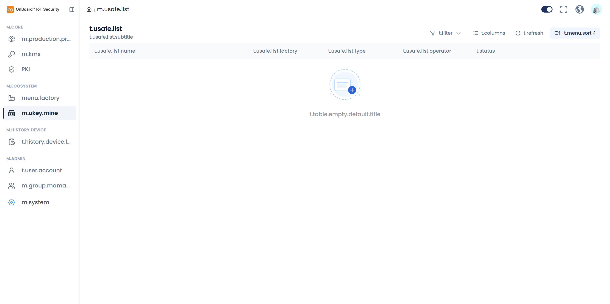 |

**复现步骤：**

1. 登录 SIT，进入任意业务页（如 U-Safe）。  
2. 点击顶栏语言 Switch（由关→开）。  
3. 观察侧栏与主区域文案。  

**期望：** 显示完整中文（或明确的目标语言）文案。  
**实际：** 大量未翻译 key 直出。

---

### BUG-02 [P1] Product：选中 Assets Tab 后 Overview 区块仍可见（内容串扰）

| 项 | 内容 |
| --- | --- |
| 模块 | Product Detail |
| 现象 | Assets 为 active 时，页面仍可见并占位渲染 `Production Version`、`Manufacturing Batch`；DOM 中同时存在 active 的 `Module_1`（高度 0） |
| 影响 | Tab 语义失效，用户误以为仍在 Overview；模块导航收敛不彻底 |
| 证据 |  · 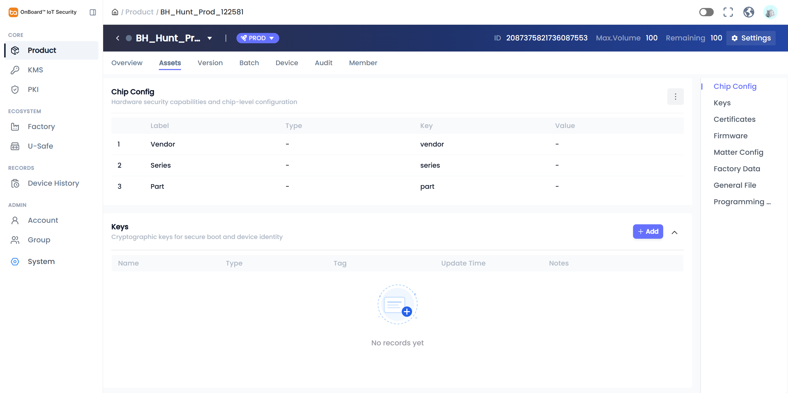 |

**复现步骤：**

1. 打开产品 `…/product/2087375821736087553`。  
2. 点击 **Assets** Tab。  
3. 向下滚动：仍可看到 Production Version / Manufacturing Batch。  
4. （可选）DevTools：`.arco-tabs-tab-active` 同时包含 Assets 与 `Module_1`。

**期望：** Assets 仅展示资产配置；Overview 专属区块隐藏；无零高度 Module Tab。  
**实际：** Overview 区块与 Module 残留并存。

---

### BUG-03 [P1] 登录：验证码倒计时中提前报错 “Enter Verification Code”

| 项 | 内容 |
| --- | --- |
| 模块 | Login |
| 现象 | Send Code 成功并出现 `NNs` 倒计时后，验证码输入框下方立即出现红色 `Enter Verification Code`，用户尚未提交 Sign In |
| 影响 | 误导用户以为发送失败；校验时机错误 |
| 证据 | 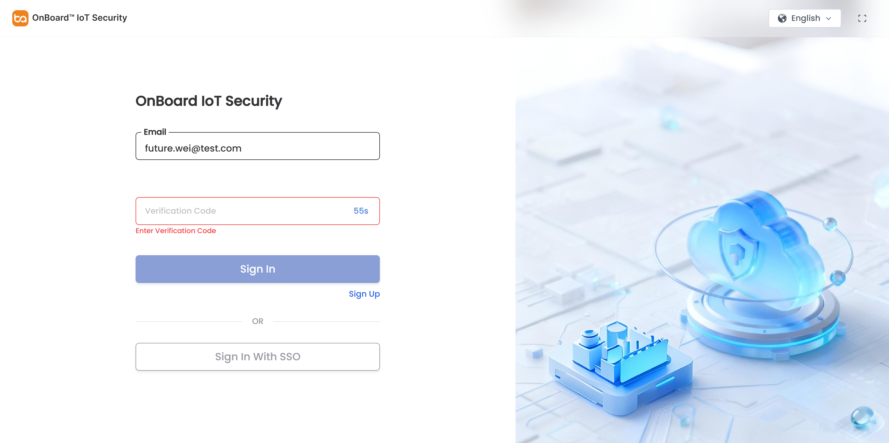 |

**复现步骤：**

1. 打开 `/login`，填写邮箱。  
2. 完成滑块，等待 Send Code 变为倒计时（如 `54s`）。  
3. **不要**输入验证码、**不要**点 Sign In。  
4. 观察验证码字段下方错误提示。

**期望：** 仅在点击 Sign In 且验证码为空时提示。  
**实际：** 发送成功后立即出现必填错误。

---

### BUG-04 [P1] Factory：Overview Tab 下同时渲染 Batch / Station / Member 内容

| 项 | 内容 |
| --- | --- |
| 模块 | Factory |
| 现象 | Overview 为 active 时，主区域同时出现 Identity U-Safe、Batch、Station、Member 多表及多个 `Sort ·1` |
| 影响 | 与 Product Tab 串扰同类问题，信息噪音大、易误操作 |
| 证据 | 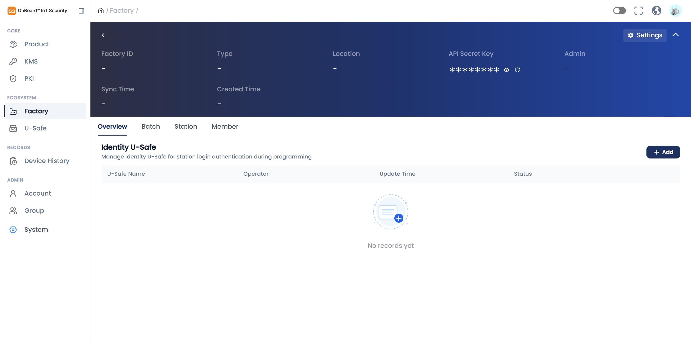 ·  |

**复现步骤：**

1. 侧栏进入 **Factory**。  
2. 确认 Tab **Overview** 为选中态。  
3. 全页滚动，可见 Batch / Station / Member 表格区。

**期望：** Overview 仅展示本 Tab 内容。  
**实际：** 多 Tab 面板同时挂载可见。

---

### BUG-05 [P2] Product 列表空态出现「幽灵」产品卡片（ID/配额为 `-`）

| 项 | 内容 |
| --- | --- |
| 模块 | Product List |
| 现象 | `/product` 展示 PROD 徽章卡片：ID `-`、Max.Volume `-`、Remaining `-`，主区 `No Data` |
| 影响 | 空态/选中态状态机错误，易误判环境无数据或选中失效 |
| 证据 | 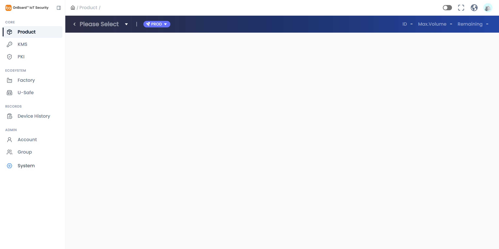 · 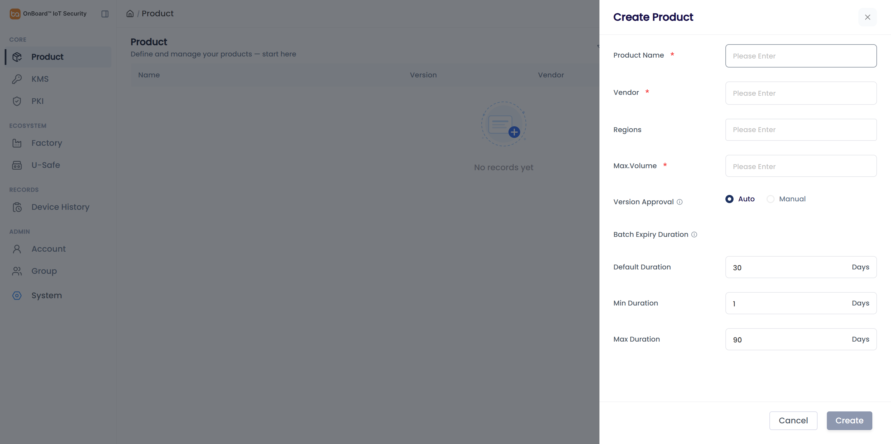 |

**复现步骤：**

1. 登录后访问 `https://iot-admin-sit.snowballtech.com/product`（列表上下文）。  
2. 观察顶部产品摘要卡与列表主体。

**期望：** 无选中产品时不展示无效 PROD 卡，或明确 Empty 引导创建。  
**实际：** 占位 `-` 卡片 + No Data。

---

### BUG-06 [P2] 侧栏可达，但若干「友好路径」直接 404

| 项 | 内容 |
| --- | --- |
| 模块 | 路由 |
| 现象 | `/account`、`/group`、`/device-history` 显示 *Whoops, this page is gone*；侧栏实际跳转分别为 `/user/list`、`/user/group/list`、`/device/list` |
| 影响 | 书签/外链/文档使用语义路径时踩坑 |
| 证据 |  ·  ·  |

**复现步骤：**

1. 浏览器直接打开上述错误路径。  
2. 对比从侧栏点击 Account / Group / Device History 的真实 URL。

**期望：** 语义路径 redirect 到真实路由，或侧栏 href 与文档一致。  
**实际：** 软 404。

---

### BUG-07 [P2] System 菜单对无权限用户仍展示，点击进入 403

| 项 | 内容 |
| --- | --- |
| 模块 | ADMIN / 权限 |
| 现象 | 侧栏可见 **System**，点击进入 `/403`：*Sorry, you don't have access to this page.* |
| 影响 | 可视为权限模型设计问题：无权限入口应隐藏或 disabled+说明 |
| 证据 | 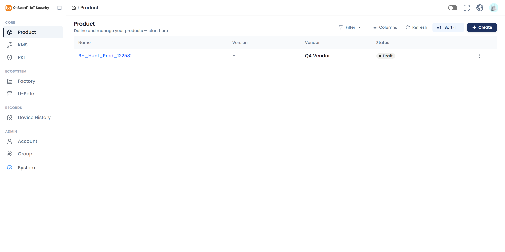 |

**复现步骤：**

1. 使用 `future.wei@test.com` 登录。  
2. 点击侧栏 **System**。

**期望：** 无权限不展示或点击前提示。  
**实际：** 进入 403 页。

---

### BUG-08 [P2] Batch Expiry Duration：存在校验文案但 Save 仍可点；数字输入易出现异常拼接

| 项 | 内容 |
| --- | --- |
| 模块 | Product Settings |
| 现象 | Default 不在 Min/Max 范围时出现 `Default duration must fall within min/max day range`，Max>90 时出现 `Max duration cannot be greater than 90 days`，但 **Save 按钮仍为可点击主按钮**；spinbutton 编辑时曾出现 `90`→`905` 类拼接 |
| 影响 | 用户可在错误态点击保存（本次重开后值未持久化为非法组合，疑似前端未提交或后端拒绝但曾提示过成功，需研发核对）；数字控件体验差 |
| 证据 | 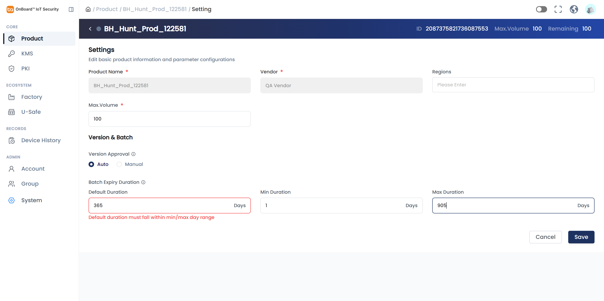 · 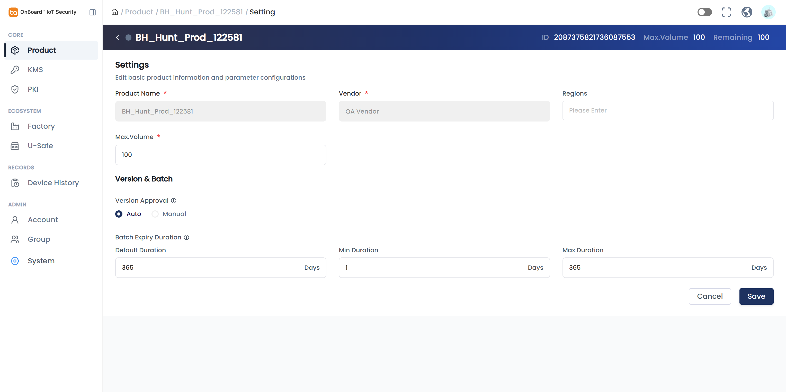 |

**复现步骤：**

1. 产品 Settings → Batch Expiry Duration。  
2. 将 Default / Max 调到不满足约束（如 Default 超出 Min–Max，或 Max>90）。  
3. 观察错误文案与 Save 是否 disabled。  
4. 对 Max 字段在未清空情况下再次输入，观察是否数字拼接。

**期望：** 非法时 Save disabled 或提交被拦截并明确失败提示；输入为替换而非追加。  
**实际：** 有文案但 Save 仍可点；输入控件不稳定。

---

### BUG-09 [P3] 空列表仍显示 Sort ·1（多模块复现）

| 项 | 内容 |
| --- | --- |
| 模块 | 列表通用组件 |
| 现象 | U-Safe / Device History / Account / Product 等在 `No records yet` / `No Data` 时仍显示 `Sort ·1`（KMS 有数据时为 `Sort ·3`，可能含默认排序，严重度较低） |
| 影响 | 计数含义不清，空态噪音 |
| 证据 | 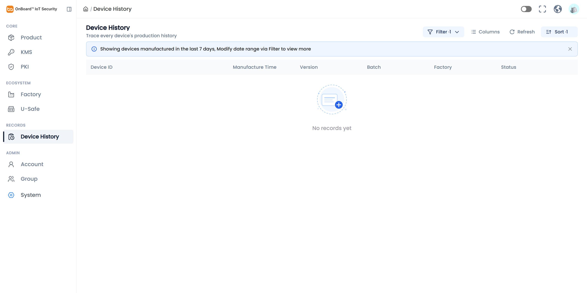 ·  · 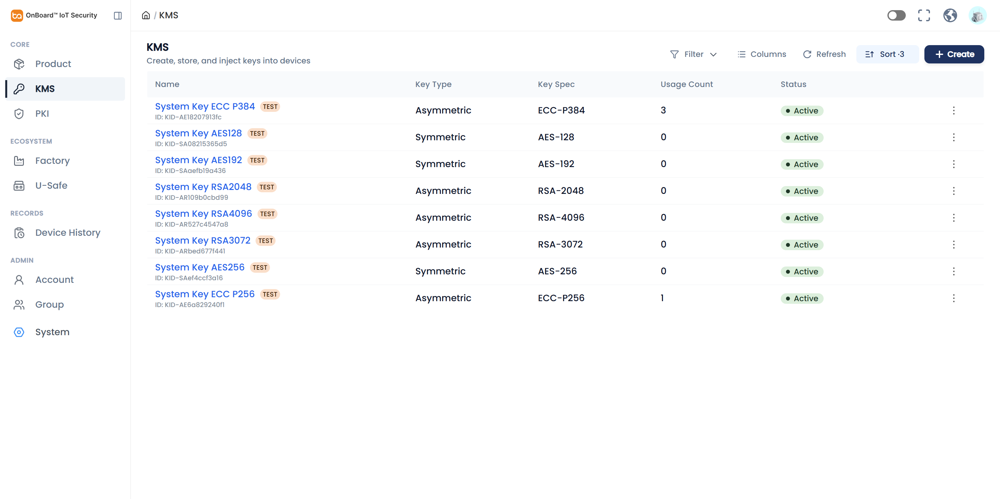 |

**复现步骤：**

1. 打开 U-Safe 或 Device History（空数据）。  
2. 观察工具条 `Sort ·1`。

**期望：** 无自定义排序时显示 `Sort` 或不计默认项；空态可弱化。  
**实际：** 固定带 ·1。

---

### BUG-10 [P3] 无障碍：表单控件缺少 id/name；Create Version/Batch 禁用无说明

| 项 | 内容 |
| --- | --- |
| 模块 | a11y / Product Overview |
| 现象 | Console issue：*A form field element should have an id or name attribute*；空产品上 Create Version/Batch 为 disabled，未见清晰 tooltip/文案说明前置依赖（需先配 Assets 等） |
| 影响 | 辅助技术可用性差；新手不知道如何解锁 Create |
| 证据 | Overview 截图 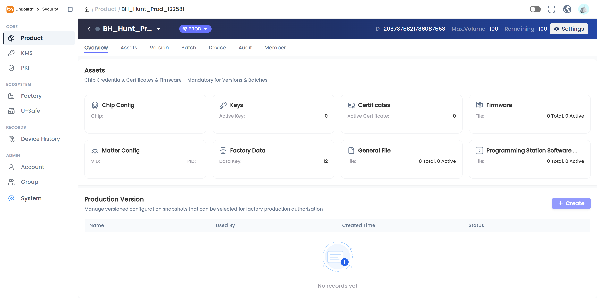；Console 记录于执行过程 |

**复现步骤：**

1. 打开新建空产品 Overview。  
2. 悬停/聚焦 disabled 的 Create。  
3. DevTools Console / Issues 面板查看 a11y 提示。

---

## 4. 观察到但未升格为 Bug 的点

| 观察 | 说明 |
| --- | --- |
| Create Product 默认 Max Duration=90 | 与近期「30→90」需求一致，属符合预期 |
| KMS `Sort ·3` | 面板内可见多列默认 Descending，更可能是默认排序计数而非空态误计数 |
| System 403 | 若产品设计为「菜单全量 + 鉴权」，可降为建议项；仍建议隐藏无权限入口 |
| 测试产品残留 | `BH_Hunt_Prod_122581` 留在 SIT，Duration 已恢复 30/1/90；可按需删除 |

---

## 5. 证据索引

| 文件 | 说明 |
| --- | --- |
| `evidence/bh-21-lang-switch.png` | BUG-01 中文 key 直出 |
| `evidence/bh-22-assets-tab-bleed.png` | BUG-02 Assets 串扰 |
| `evidence/bh-07-assets-bleed.png` | BUG-02 补充 |
| `evidence/bh-24-login-otp-premature-error.png` | BUG-03 登录误报 |
| `evidence/bh-18-factory-bleed.png` | BUG-04 Factory 串扰 |
| `evidence/bh-08-product-list-odd.png` | BUG-05 幽灵卡片 |
| `evidence/bh-13/14/19-*.png` | BUG-06 软 404 |
| `evidence/bh-16-system-403.png` | BUG-07 |
| `evidence/bh-10/11-*.png` | BUG-08 Duration |
| `evidence/bh-20/15/12-*.png` | BUG-09 Sort 计数 |
| `evidence/bh-01`～`bh-06` 等 | 探索过程上下文 |

---

## 6. 建议修复优先级

1. **立即：** BUG-01（i18n）、BUG-02 / BUG-04（Tab 面板 `destroyOnHide` / 条件渲染）。  
2. **本迭代：** BUG-03（校验时机）、BUG-05（列表选中态）、BUG-08（Save disable + 数字输入）。  
3. **可排期：** BUG-06 路由别名、BUG-07 菜单鉴权、BUG-09/10 体验与 a11y。

---

*本报告为探索式测试结果，缺陷需研发确认根因；截图均为 SIT 实机操作凭证。*
