# 英文文案测试执行报告 — OnBoard IoT Security (SIT)

| 项 | 内容 |
| --- | --- |
| 环境 | https://iot-admin-sit.snowballtech.com |
| 界面语言 | English（顶栏语言为 English / Switch 关闭） |
| 账号 | `future.wei@test.com`（验证码不落盘） |
| 执行日期 | 2026-08-12 |
| 范围 | 登录、Product（列表/创建/Overview/Assets/Settings）、KMS、PKI、Factory、U-Safe、Device History、Account、Group、403 |
| 证据目录 | [evidence/](./evidence/) |

---

## 1. 结论摘要

共记录 **14** 条英文文案问题（**P1×2 / P2×7 / P3×5**）。  
最严重：协作邀请弹窗模板残缺（缺邀请人/产品名，语句不通）；其次为全局占位符 `Please Enter` 中式直译、面包屑 `Setting`/`Settings` 不一致、Device History 提示语句法错误。

整体观感：模块副标题多为可读英文，但存在 **Title Case / 缩写 / 术语** 不统一，以及若干 **翻译腔** 表达。

---

## 2. 执行步骤与覆盖场景

### 2.1 登录

1. 打开 `/login`，确认界面为 English。  
2. 发送验证码，记录成功 Toast 与按钮文案。  
3. 使用验证码登录进入 Product 列表。

**验证场景：** 登录页标签、按钮大小写、成功提示语气。

### 2.2 Product

1. Product 列表标题/副标题、Create Product 表单标签与占位符。  
2. 打开产品 `BH_Hunt_Prod_122581` Overview / Assets / Settings。  
3. 触发 Batch Expiry Duration 校验，记录错误文案。  
4. 对照 Overview 卡片标题与 Assets 区块完整标题。  
5. 检查 DOM 中挂载的邀请确认弹窗文案模板。

**验证场景：** 表单标签、占位符、校验句、术语一致性、邀请文案模板。

### 2.3 KMS / PKI

1. KMS 列表副标题；进入 Create Key 全页分区文案。  
2. PKI 列表标题与列名。

**验证场景：** 创建流程说明文案、分区标题用词。

### 2.4 Factory / U-Safe / Device History

1. Factory Overview（含 Identity U-Safe 说明）。  
2. U-Safe 列表副标题（EdgeHSM 表述）。  
3. Device History 默认 7 天提示条。

**验证场景：** 模块副标题语气、提示句语法。

### 2.5 ADMIN

1. Account 列表与 Create Account 弹窗。  
2. Group 列表与 Create Group 弹窗。  
3. `/403` 无权限页。

**验证场景：** 管理侧表单用词、错误页措辞。

---

## 3. 潜在文案问题清单

### COPY-01 [P1] 协作邀请弹窗英文模板残缺、语句不通

| 项 | 内容 |
| --- | --- |
| 模块 | Product / Invitation |
| 现象 | DOM 中挂载弹窗文案为：`Confirm Accepting Invitation` + ` invites you to join the product collaboration team:`（邀请人缺失导致以空格+invites 开头）+ `Product Name:` / `Organization:` 为空 + `Click the button "Accept" to accept the invitation` |
| 问题类型 | 模板插值失败 + 不自然英文 |
| 建议改写 | 标题：`Accept invitation`；正文：`{Inviter} invites you to join the product collaboration team.` / `Product: {name}` / `Organization: {org}`；操作说明可省略或改为 `Select Accept to join.` |
| 证据 | 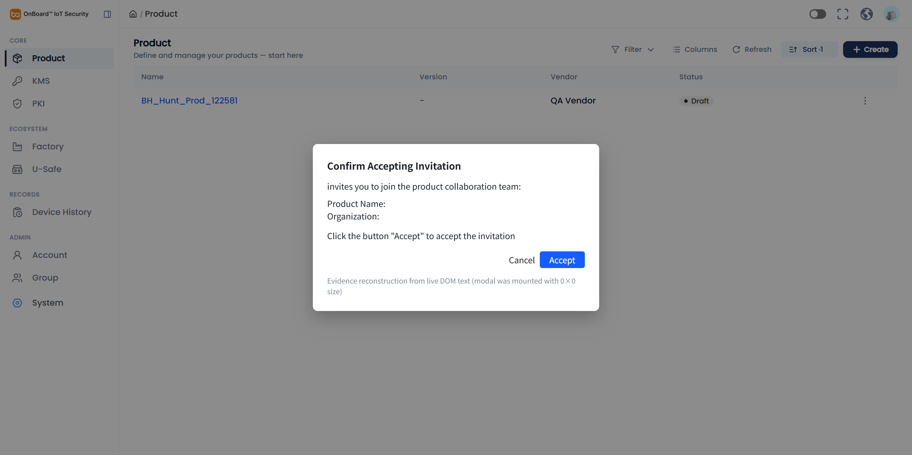（由线上 DOM `innerText` 还原可视化；原 Arco Modal 尺寸为 0×0 未浮层展示） |

**复现步骤：**

1. 使用 `future.wei@test.com` 登录 SIT。  
2. 打开 `/product/list`。  
3. DevTools 查找含 `Confirm Accepting Invitation` 的 `.arco-modal`，查看 `innerText`。  

**期望：** 邀请人、产品名、组织完整；语句语法正确。  
**实际：** 主语缺失、字段空、标题/正文粘连感强。

---

### COPY-02 [P1] Device History 提示句：逗号粘连 + 句中错误大写

| 项 | 内容 |
| --- | --- |
| 模块 | Device History |
| 原文 | `Showing devices manufactured in the last 7 days, Modify date range via Filter to view more` |
| 问题 | 逗号连接两个独立分句；`Modify` 不应在逗号后大写 |
| 建议改写 | `Showing devices manufactured in the last 7 days. Use Filter to change the date range.` |
| 证据 | 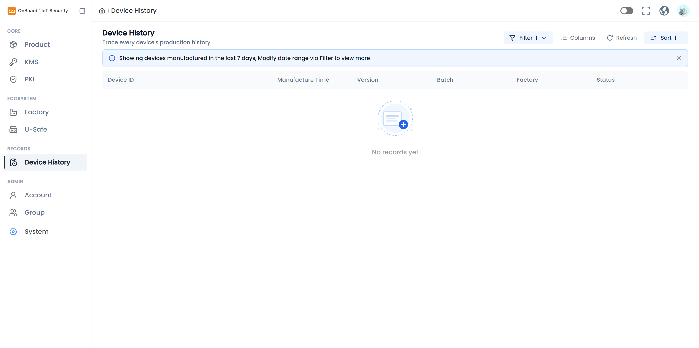 |

**复现步骤：** 侧栏进入 Device History（`/device/list`），查看列表上方灰字提示。

---

### COPY-03 [P2] 全局占位符 `Please Enter` 为中式直译且大小写不当

| 项 | 内容 |
| --- | --- |
| 模块 | 多处表单（Create Product / Settings / Account / Group / Key 等） |
| 原文 | Placeholder: `Please Enter` |
| 问题 | 英文习惯为 `Please enter`，更佳为场景化占位（如 `Enter product name`）；当前像中文「请输入」直译 |
| 证据 | 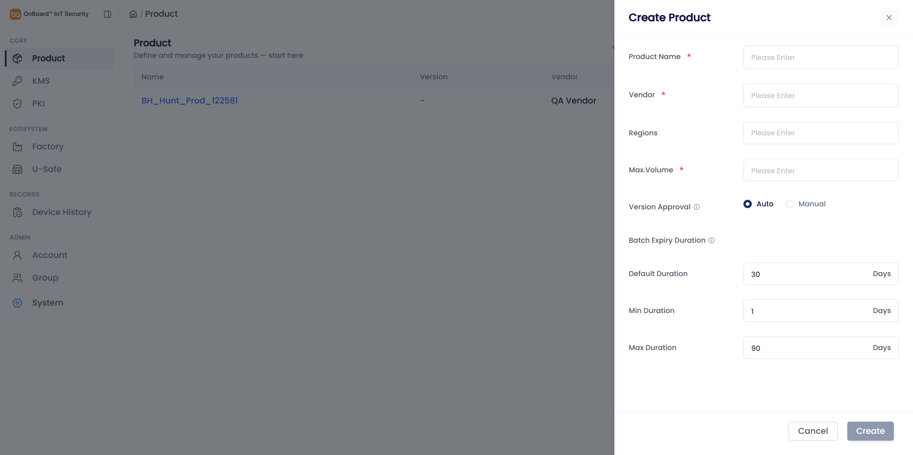 · 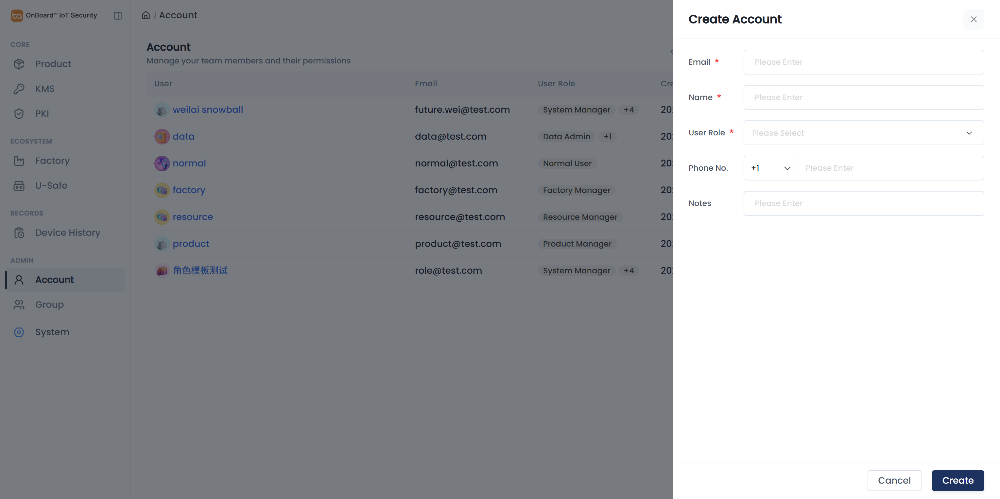 · 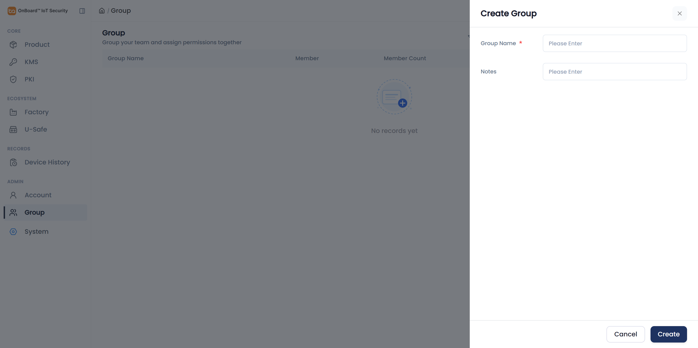 |

**复现步骤：** 打开任意 Create/Settings 表单，聚焦输入框查看 placeholder。

---

### COPY-04 [P2] 面包屑 `Setting` 与页面标题 `Settings` 单复数不一致

| 项 | 内容 |
| --- | --- |
| 模块 | Product Settings |
| 原文 | 面包屑：`Setting`；主标题：`Settings` |
| 建议 | 统一为 `Settings` |
| 证据 | 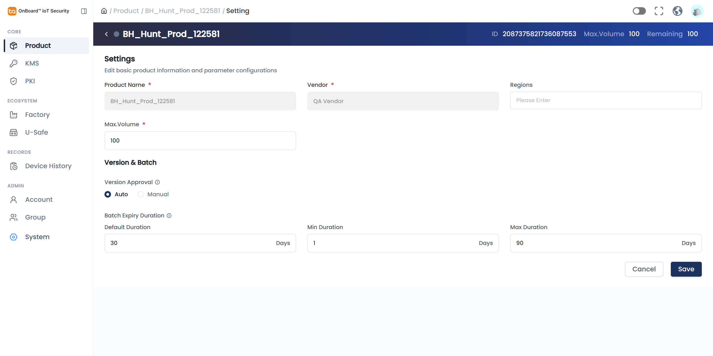 |

**复现步骤：** 产品详情 → Settings，查看顶部面包屑与 H1。

---

### COPY-05 [P2] 登录页：`Sign In With SSO` 与成功提示语气不自然

| 项 | 内容 |
| --- | --- |
| 模块 | Login |
| 原文 | 按钮：`Sign In With SSO`；Toast：`Sent successfully, the verification code is valid for 10 minutes.` |
| 问题 | 介词 `with` 在 Title Case 中通常小写 → `Sign In with SSO`；成功句头重脚轻，偏翻译腔 |
| 建议改写 | Toast：`Verification code sent. It is valid for 10 minutes.` |
| 证据 |  · 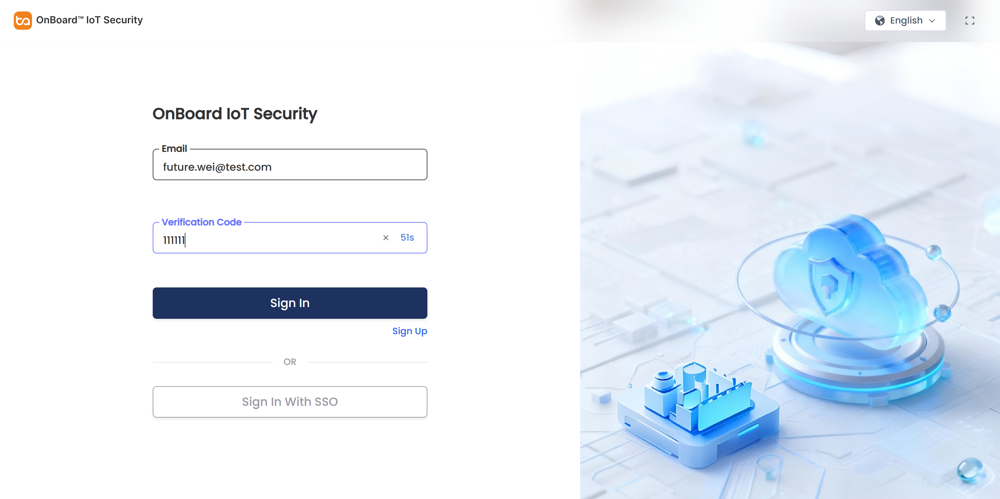 |

**复现步骤：** 打开登录页；完成滑块发送验证码后查看 Toast。

---

### COPY-06 [P2] 标签 `Max.Volume` 缺少空格 / 标点不统一

| 项 | 内容 |
| --- | --- |
| 模块 | Product 列表卡片 / Create / Settings |
| 原文 | `Max.Volume` |
| 建议 | `Max. Volume` 或 `Max volume`（并在产品内统一缩写风格） |
| 证据 |  ·  |

---

### COPY-07 [P2] Group 副标题动词使用别扭

| 项 | 内容 |
| --- | --- |
| 模块 | Group |
| 原文 | `Group your team and assign permissions together` |
| 问题 | 以产品名当动词起句生硬；`together` 冗余 |
| 建议改写 | `Organize members into groups and assign permissions` |
| 证据 |  |

**复现步骤：** 侧栏 ADMIN → Group。

---

### COPY-08 [P2] Create Key：分区说明与 “Setting” 用词生硬

| 项 | 内容 |
| --- | --- |
| 模块 | KMS → Create Key |
| 原文 | `Configure key basic identifier and crypto scenario`；分区名 `Key Source Setting` / `Validity Setting` |
| 问题 | 缺冠词/所有格；`crypto scenario` 偏内部黑话；`Setting` 作分区标题更自然为 `Settings` 或直接 `Source` / `Validity` |
| 建议改写 | `Set the key name and cryptographic parameters`；`Key source` / `Validity` |
| 证据 | 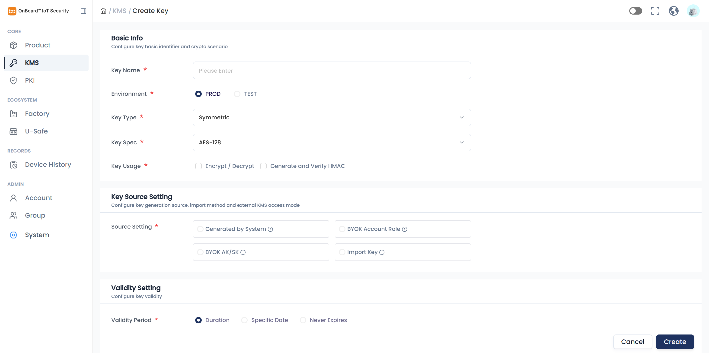 |

**复现步骤：** KMS → Create，阅读 Basic Info / Source / Validity 说明。

---

### COPY-09 [P2] Assets 说明句破折号后错误 Title Case

| 项 | 内容 |
| --- | --- |
| 模块 | Product Overview / Assets |
| 原文 | `Chip Credentials, Certificates & Firmware – Mandatory for Versions & Batches` |
| 问题 | 破折号后 `Mandatory`/`Versions`/`Batches` 过度大写，读起来不像完整句子 |
| 建议改写 | `Chip credentials, certificates, and firmware — required for versions and batches` |
| 证据 | 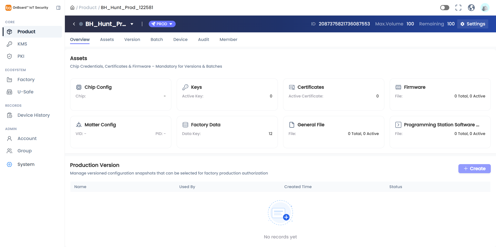 |

---

### COPY-10 [P2] 同一资产名称不一致：Software vs Software Package

| 项 | 内容 |
| --- | --- |
| 模块 | Product Overview 卡片 vs Assets 区块/锚点 |
| 原文 | Overview 卡片：`Programming Station Software`；Assets：`Programming Station Software Package` |
| 问题 | 同一对象两种命名，增加理解成本 |
| 建议 | 全站统一为 `Programming Station Software Package`（或统一短名并加 Tooltip） |
| 证据 | 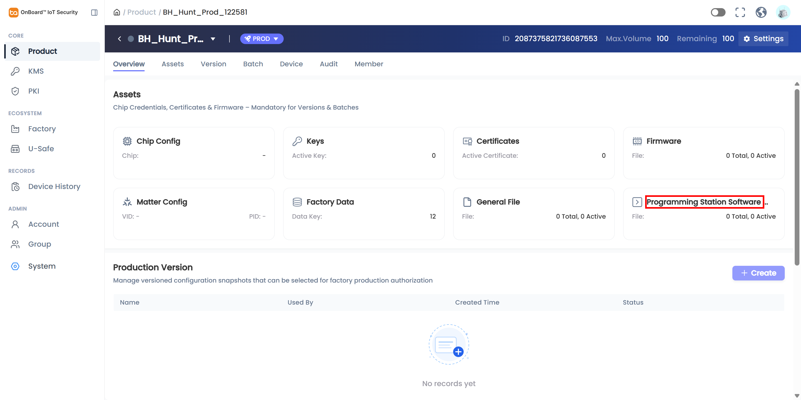 · 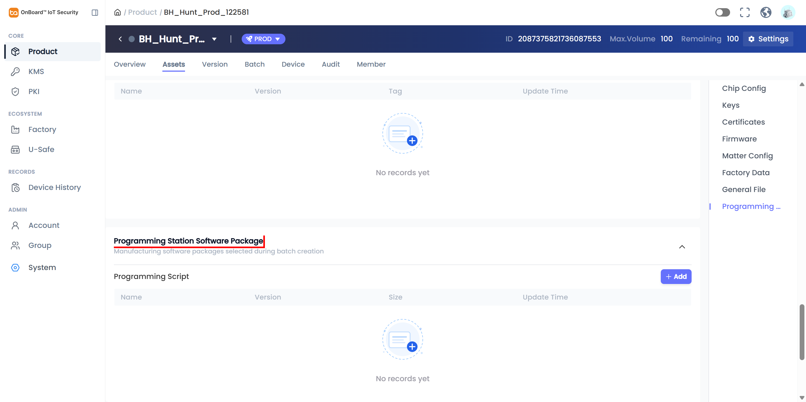 |

---

### COPY-11 [P3] Product 列表副标题 “start here” 不适合回访场景

| 项 | 内容 |
| --- | --- |
| 模块 | Product List |
| 原文 | `Define and manage your products — start here` |
| 问题 | 营销/引导语气；对已有产品用户不贴切 |
| 建议改写 | `Define and manage your products` |
| 证据 | 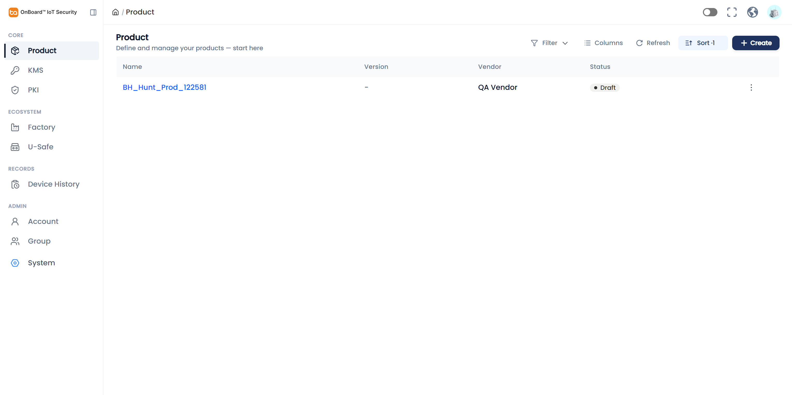 |

---

### COPY-12 [P3] 校验文案 `min/max day range` 搭配不自然

| 项 | 内容 |
| --- | --- |
| 模块 | Product Settings |
| 原文 | `Default duration must fall within min/max day range`（另有 `Max duration cannot be greater than 90 days`） |
| 建议改写 | `Default duration must be between the minimum and maximum duration.` |
| 证据 | 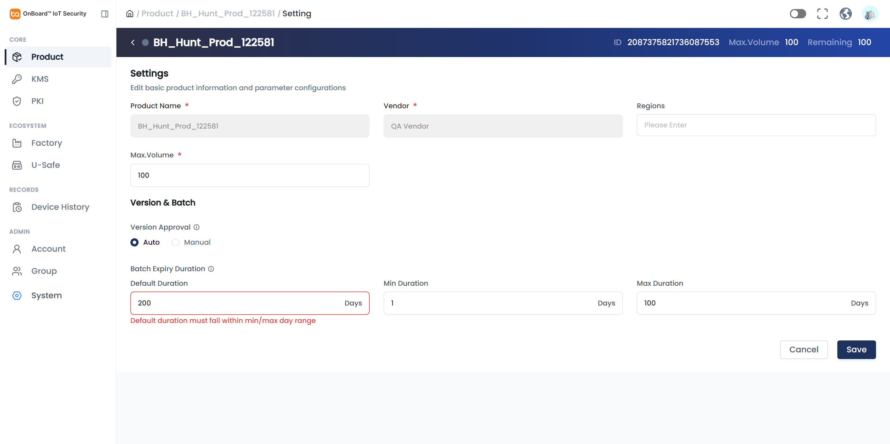 |

**复现步骤：** Settings → 将 Default Duration 调出 Min–Max 范围。

---

### COPY-13 [P3] 状态/计数展示大小写与术语不统一

| 项 | 内容 |
| --- | --- |
| 模块 | Product |
| 原文 | 列表 Status：`Draft`；详情徽章：`PROD`；卡片统计：`0 Total, 0 Active` |
| 问题 | Draft/PROD 语义层级混用；`Total`/`Active` 作普通词时宜小写或改为 `Total 0 · Active 0` |
| 证据 |  ·  |

---

### COPY-14 [P3] Account 表单 `Phone No.` 缩写生硬；U-Safe 副标题动词偏弱

| 项 | 内容 |
| --- | --- |
| 模块 | Account / U-Safe |
| 原文 | `Phone No.`；`Check EdgeHSM devices linked to your factory` |
| 建议 | `Phone number`；`View EdgeHSM (U-Safe) devices linked to your factory`（并明确 U-Safe 与 EdgeHSM 关系） |
| 证据 |  · 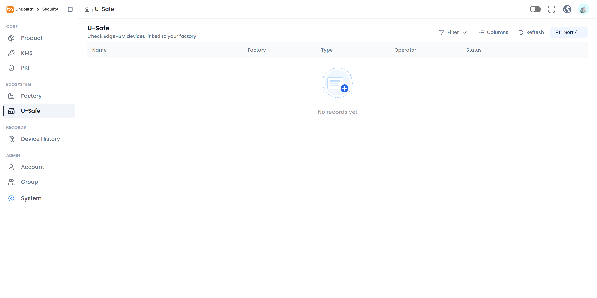 |

---

## 4. 文案质量尚可、未单列缺陷的页面

| 页面 | 观察 |
| --- | --- |
| PKI 副标题 | `Issue digital identity certificates for your devices` — 清晰 |
| KMS 副标题 | `Create, store, and inject keys into devices` — 清晰 |
| Account 副标题 | `Manage your team members and their permissions` — 清晰 |
| KMS Lock 确认 | `After locking, this key cannot be used...` — 基本专业 |
| 403 | `Sorry, you don't have access to this page.` — 自然 |
| Factory Identity U-Safe | 可理解，略长但不算错误 |

---

## 5. 证据索引

| 文件 | 对应 |
| --- | --- |
| `en-01/02-login*.png` | COPY-05 |
| `en-03-product-list.png` | COPY-11 / COPY-13 |
| `en-05-create-product.png` | COPY-03 / COPY-06 |
| `en-06-product-overview.png` | COPY-09 / COPY-13 |
| `en-07/08-settings*.png` | COPY-04 / COPY-12 |
| `en-10-create-key.png` | COPY-08 |
| `en-14-device-history.png` | COPY-02 |
| `en-15-usafe.png` / `en-16-account.png` / `en-17-group.png` | COPY-07 / COPY-14 |
| `en-22-invite-dom-evidence.png` | COPY-01 |
| `en-23/24-*.png` | COPY-10 |

---

## 6. 修复建议优先级

1. **本迭代必改：** COPY-01（邀请模板）、COPY-02（Device History 语法）、COPY-03（Please Enter）。  
2. **文案一致性一轮：** COPY-04/06/09/10/13（Setting(s)、Max. Volume、Assets 说明、Package 命名、状态词）。  
3. **润色：** COPY-05/07/08/11/12/14。

---

*本报告聚焦英文文案表达与一致性；功能性 Bug（如 Tab 串扰、中文 i18n key）见 `docs/execution/bug-hunt-20260812/report.md`。*
