# OBIS Free Test（深度探索）执行报告

| 项 | 内容 |
| --- | --- |
| 环境 | https://iot-admin-sit.snowballtech.com |
| 账号 | `feng.zhang@snowballtech.com`（验证码不落盘） |
| 界面语言 | English（顶栏 Switch 关闭；另专项验证中文切换） |
| 执行日期 | 2026-08-13 |
| 测试类型 | Free Test / 深度探索 |
| 覆盖模块 | Product、KMS、PKI、Factory、Account、Group（入口）、Device History、DAC Report、Tenant、Role、User (SNB)、DAC Topup、Language、Resources、Parameters |
| 样例产品 | `Product version 001`（ID: `2087724639605358593`） |
| 证据目录 | [evidence/](./evidence/) |

---

## 1. 结论摘要

在高权限账号下完成多模块深度探索，共记录 **12** 个问题（**P0×1 / P1×3 / P2×5 / P3×3**）。

最严重：

1. **中文语言切换整站 i18n key 直出**（含 key 拼写错误 `m.group.mamagement`）  
2. **Product 多 Tab 内容串扰**（Assets / Vulnerability / OTA / Batch 仍渲染 Overview 区块 + 残留 `Module_1`）  
3. **Factory Overview 同样串扰**，空工厂头信息全为 `-`

高权限账号可见 OPERATION / SYSTEM 菜单，便于覆盖 Tenant / Role / Language 管理等租户侧能力。

---

## 2. 执行步骤与验证场景

### 2.1 登录与权限面

1. `/login` 使用 `feng.zhang@snowballtech.com` + 验证码登录。  
2. 确认侧栏除 CORE/ECOSYSTEM/RECORDS/ADMIN 外，还有 **OPERATION**（Tenant / Role / User (SNB) / DAC Topup）与 **SYSTEM**（Language / Resources / Parameters）。  

**场景：** 高权限入口可见性、登录可用性。

### 2.2 Product（深测）

1. Product 列表（Total: 217）：排序/分页/Create 入口。  
2. 进入 `Product version 001`：Overview / Assets / Version / Batch / **Vulnerability** / **OTA** / Device / Audit / Member。  
3. 在各 Tab 检查是否仍可见 Overview 的 Assets 摘要、Production Version、Manufacturing Batch。  
4. DOM 检查 `Module_1` active 残留。  
5. Settings：面包屑与 Batch Expiry 配置区。  
6. Create Batch：Basic / Advanced / Script 分区与背景串扰。  

**场景：** Tab 隔离、模块收敛残留、创建 Batch、Settings、列表规模与分页。

### 2.3 KMS / PKI

1. KMS 列表：Filter / Sort ·3 / Create；观察隐藏 Confirm Lock/Unlock/Revoke。  
2. PKI 列表与 Create Certificate（Basic Info / Validity）。  

**场景：** 密钥/证书列表与创建表单可达性、默认文案。

### 2.4 Factory / Device / DAC

1. Factory：未选工厂时空态头信息、Overview 下多表是否同时渲染。  
2. Device History：默认 7 天提示、Filter ·1。  
3. DAC Report：额度汇总与流水（Batch Reserve / Return）。  

**场景：** 工厂空态、Tab 隔离、DAC 台账可读性。

### 2.5 Account / Role / Tenant

1. Account：列表（Total: 109）、Create Account 弹窗字段。  
2. Role Management：角色名/类型/租户展示。  
3. Tenant Management：租户列表与联系人/电话展示。  

**场景：** 账号开通表单、角色命名、租户主数据展示。

### 2.6 SYSTEM Language 与顶栏语言切换

1. 侧栏 Language → `/system/i18n/list`；对照手输 `/language`。  
2. 顶栏 Switch 切到非 English，观察侧栏与页面文案。  
3. 切回 English。  

**场景：** i18n 管理、前端语言包加载、路由别名。

---

## 3. 缺陷 / 问题清单

### FT-01 [P0] 顶栏切中文后整站显示 i18n Key

| 项 | 内容 |
| --- | --- |
| 模块 | 全局 / i18n |
| 现象 | Switch 打开后侧栏与页面变为 `m.production.product.management`、`m.group.mamagement`、`t.user.account` 等；其中 **`mamagement` 为拼写错误**（应为 management） |
| 证据 | 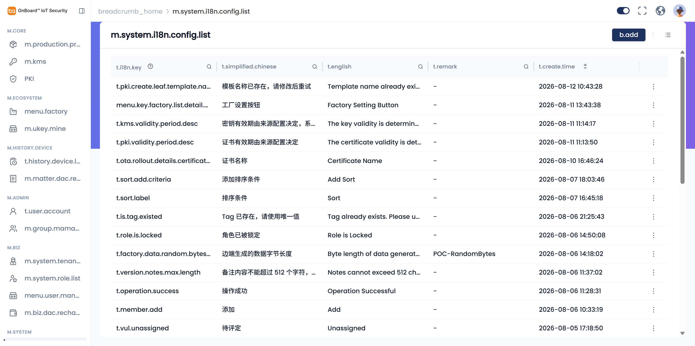 |

**复现步骤：**

1. 登录后任意业务页。  
2. 打开顶栏语言 Switch（English → 中文侧）。  
3. 观察侧栏与主区域。  

**期望：** 显示完整中文文案。  
**实际：** key 直出，部分 key 本身拼写错误。

---

### FT-02 [P1] Product：非 Overview Tab 仍渲染 Overview 内容（系统性串扰）

| 项 | 内容 |
| --- | --- |
| 模块 | Product Detail |
| 现象 | 选中 **Assets / Vulnerability / OTA / Batch** 时，页面仍可见并占位：`Chip Credentials…`、`Production Version`、`Manufacturing Batch`；同时存在高度为 0 的 active **`Module_1`** Tab |
| 影响 | Tab 语义失效；模块导航收敛不彻底；长页滚动噪音大 |
| 证据 | 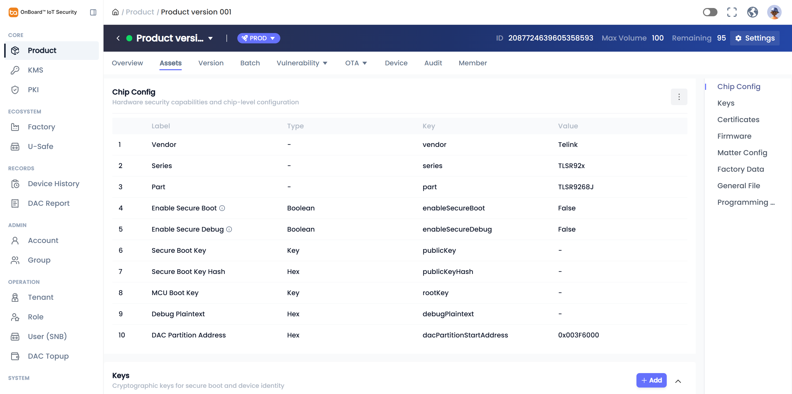 · 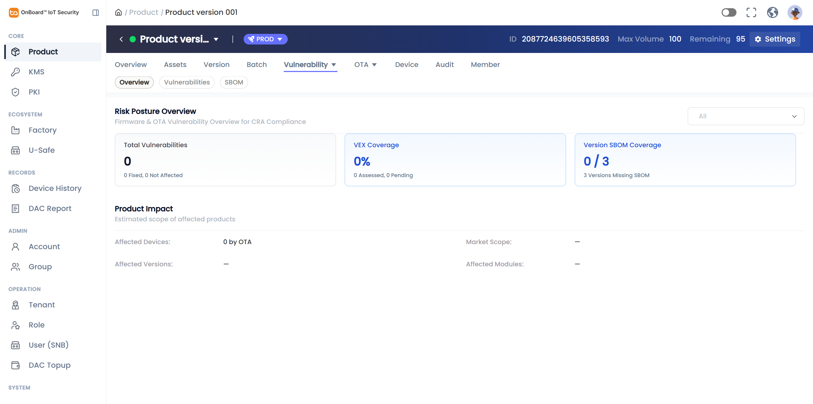 · 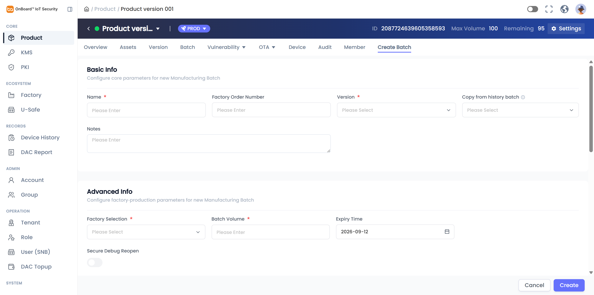 |

**复现步骤：**

1. 打开 `…/product/2087724639605358593`。  
2. 依次点击 Assets、Vulnerability、OTA、Batch。  
3. 观察主区是否仍出现 Production Version / Manufacturing Batch 区块。  
4. DevTools：`.arco-tabs-tab-active` 含 `Module_1` 且 height≈0。

---

### FT-03 [P1] Factory：Overview 下 Batch/Station/Member 同时可见；空工厂头为 `-`

| 项 | 内容 |
| --- | --- |
| 模块 | Factory |
| 现象 | Overview active 时 Identity U-Safe + Batch + Station + Member 多表同时出现（多个 `Sort ·1`）；未选工厂时 Factory ID/Type/Location/Admin 等全为 `-`，API Secret 仍显示掩码 |
| 证据 | 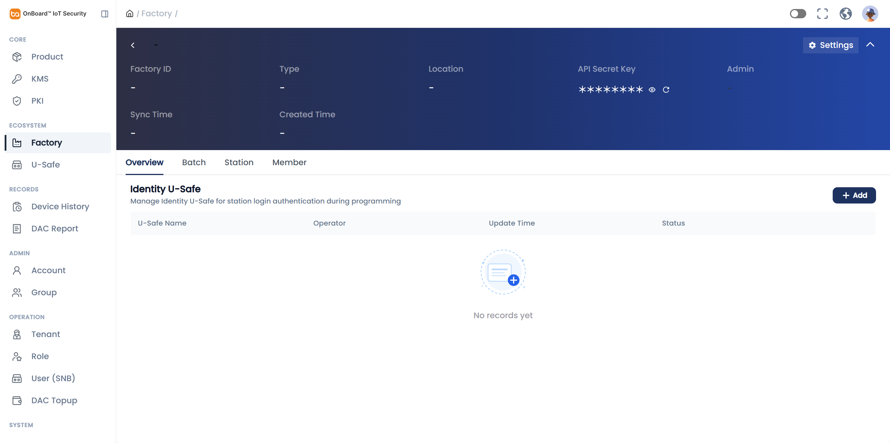 |

**复现步骤：** 侧栏进入 Factory，保持 Overview，全页滚动。

---

### FT-04 [P1] 语义路由软 404（侧栏正常、手输路径 Whoops）

| 项 | 内容 |
| --- | --- |
| 模块 | 路由 |
| 现象 | `/language` → Whoops；侧栏 Language 实际为 `/system/i18n/list`。同类问题亦见于 `/account`→`/user/list` 等（本账号侧栏可到达正确路由） |
| 证据 | 执行中访问 `/language` 复现；Language 正确页见 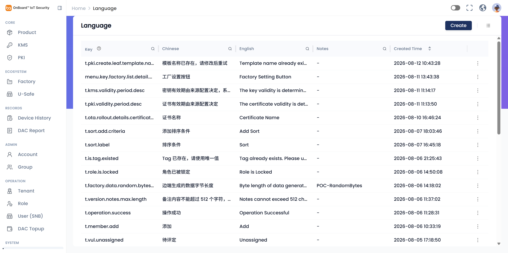 |

**复现步骤：** 浏览器直接打开 `https://iot-admin-sit.snowballtech.com/language`。

---

### FT-05 [P2] Device History 提示句语法问题（逗号粘连）

| 项 | 内容 |
| --- | --- |
| 模块 | Device History |
| 原文 | `Showing devices manufactured in the last 7 days, modify date range via Filter to view more` |
| 建议 | `Showing devices manufactured in the last 7 days. Use Filter to change the date range.` |
| 证据 | 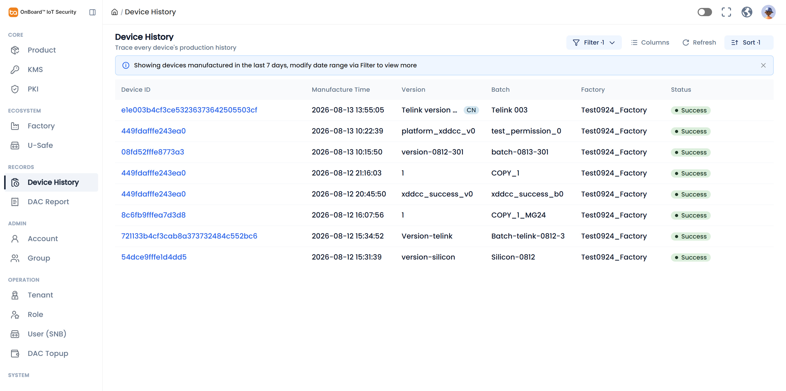 |

---

### FT-06 [P2] Settings 面包屑 `Setting` vs 标题 `Settings`

| 项 | 内容 |
| --- | --- |
| 模块 | Product Settings |
| 证据 | 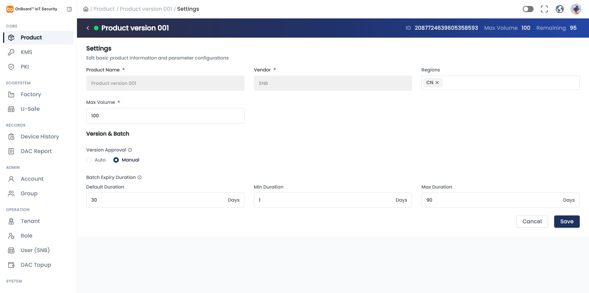 |

**复现步骤：** 产品详情 → Settings，对比面包屑与主标题。

---

### FT-07 [P2] 表单占位符全局 `Please Enter`（中式直译）

| 项 | 内容 |
| --- | --- |
| 模块 | Account / Product Create / Settings 等 |
| 建议 | `Please enter` 或场景化 `Enter email` / `Enter product name` |
| 证据 | 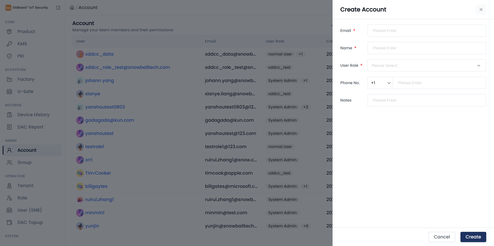 |

---

### FT-08 [P2] Account 角色展示大小写不统一

| 项 | 内容 |
| --- | --- |
| 模块 | Account / Role |
| 现象 | Account 列表出现 `normal User`；Role 列表为 `Normal User`；另有角色名 `have all permission`（语法不自然，建议 `Full access` / `Has all permissions`） |
| 证据 |  · 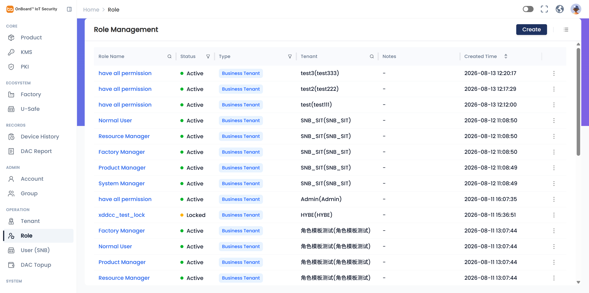 |

---

### FT-09 [P2] Language 管理数据/文案质量问题

| 项 | 内容 |
| --- | --- |
| 模块 | SYSTEM → Language |
| 现象 | 列头 `Key ` 疑似尾随空格；中文条目截断如 `…系统默认设置为"无限期`（缺闭合）；英文 `Factory Setting Button` 不自然 |
| 证据 |  |

---

### FT-10 [P3] Overview 卡片标题截断/命名不一致

| 项 | 内容 |
| --- | --- |
| 模块 | Product Overview / Assets |
| 现象 | 卡片区见 `Programming Station Software ...`；Assets 锚点/区块为 `Programming Station Software Package` |
| 证据 |  |

---

### FT-11 [P3] 登录后验证码字段过早报错（回归）

| 项 | 内容 |
| --- | --- |
| 模块 | Login |
| 现象 | Send Code 成功出现倒计时后，未点 Sign In 即显示 `Enter Verification Code` |
| 说明 | 与此前 Bug Hunt 一致，本账号登录时再次出现 |

---

### FT-12 [P3] Tenant 电话展示疑似国家码错误（数据/校验）

| 项 | 内容 |
| --- | --- |
| 模块 | Tenant |
| 现象 | 联系电话展示为 `+1 189283982828`（`+1` 与号段观感不匹配，可能校验/展示缺陷或脏数据） |
| 证据 | 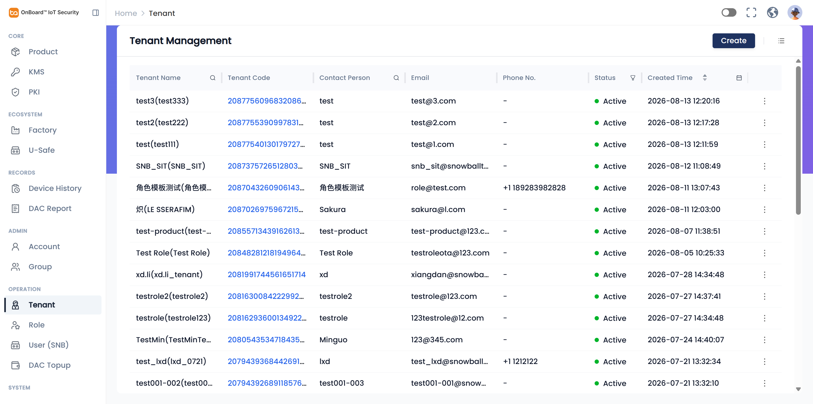 |

---

## 4. 探索中未升格为缺陷的观察

| 观察 | 说明 |
| --- | --- |
| Product Total 217 / Account 109 | SIT 数据量大，列表性能本次未专项压测 |
| KMS/PKI Create 表单 | 基本可用；分区说明英文总体可读 |
| DAC Report | 汇总与流水清晰，中文操作者姓名为业务数据 |
| Vulnerability / OTA | 功能区存在（Risk Posture / OTA Rollouts），但被 Overview 串扰掩盖 |
| Resources / Parameters / User (SNB) / DAC Topup | 侧栏可达，本次以入口冒烟为主，未做写操作破坏性测试 |
| 未执行真实烧录/产线动作 | 避免影响 SIT 产线数据；Batch Create 仅打开表单未提交 |

---

## 5. 证据索引

| 文件 | 说明 |
| --- | --- |
| `ft-01-product-list.png` | 高权限侧栏 + Product 列表 |
| `ft-02/04/05-*.png` | Product Tab 串扰 / Vulnerability / Create Batch |
| `ft-03-settings.png` | Setting(s) 面包屑 |
| `ft-06/07-*.png` | KMS / PKI |
| `ft-08-factory.png` | Factory 串扰与空态 |
| `ft-09-account.png` | Account Create |
| `ft-10-dac-report.png` | DAC Report |
| `ft-11/12-*.png` | Language 管理 + 顶栏中文 key 直出 |
| `ft-13-tenant.png` | Tenant |
| `ft-14-pagination.png` | Product 分页 |
| `ft-15-role.png` | Role |
| `ft-16-device.png` | Device History 提示句 |

---

## 6. 建议优先级

1. **立即：** FT-01（中文包/加载）、FT-02 / FT-03（Tab `destroyOnHide` 或条件渲染 + 移除 Module_1）。  
2. **本迭代：** FT-04 路由别名、FT-05/06/07/08 文案与展示一致性。  
3. **可排期：** FT-09~12 文案润色、i18n 数据治理、电话校验。

---

*本报告为 SIT 深度 Free Test 结果；截图均为实机操作凭证。未对生产数据做破坏性变更（未提交 Create Batch / 未改 Tenant）。*
