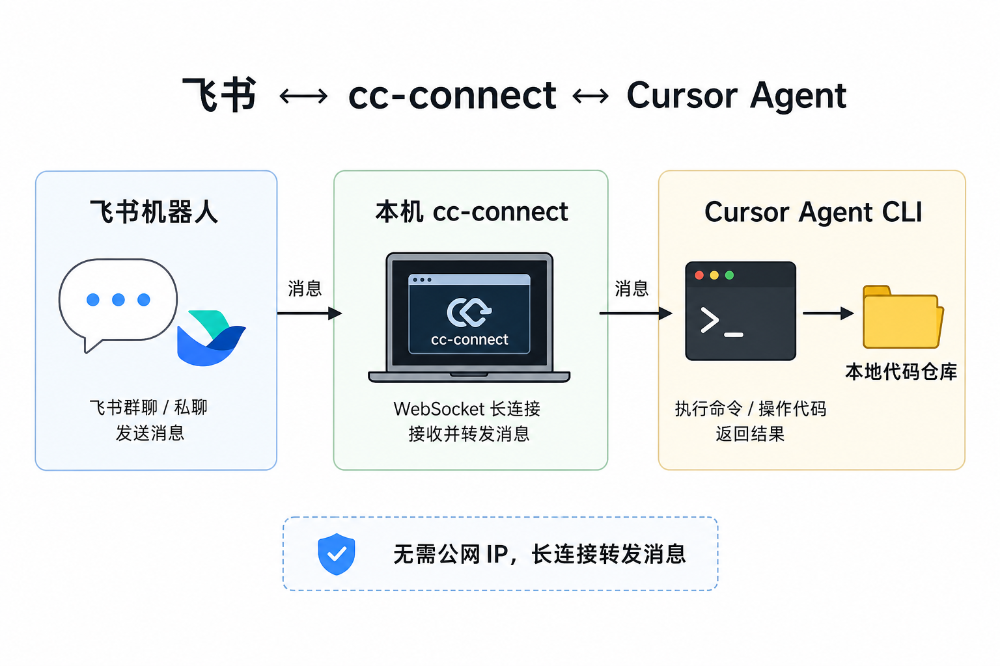
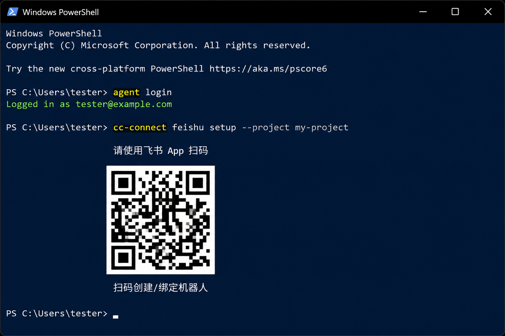
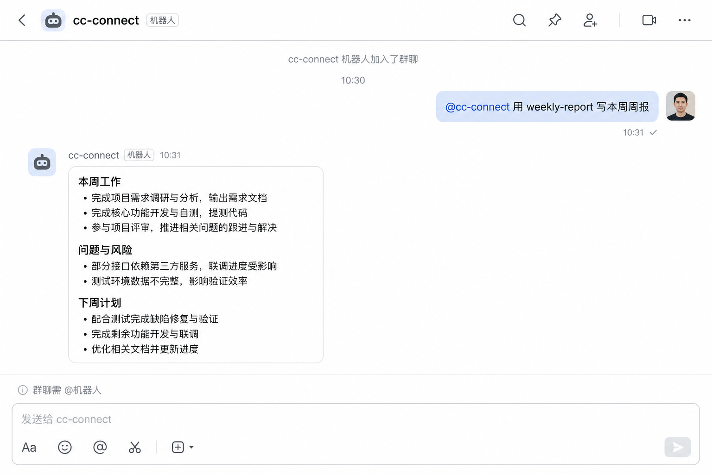

# 飞书机器人接入 Cursor Agent CLI（cc-connect）实践指南

> 面向测试组：在飞书里 @ 机器人，驱动本机 Cursor Agent 读写仓库、跑 Skill（周报、回归评审、用例设计等）。  
> 验证环境：Windows 10/11 · Cursor Agent CLI `2026.08.04` · cc-connect `v1.4.1`  
> 上游项目：[chenhg5/cc-connect](https://github.com/chenhg5/cc-connect) · [飞书接入说明](https://github.com/chenhg5/cc-connect/blob/main/docs/feishu.md)

---

## 1. 这是什么

| 组件 | 作用 |
|------|------|
| **飞书机器人** | 聊天入口：私聊或群里 @ |
| **cc-connect** | 本机长驻桥接：WebSocket 收飞书消息 → 调本地 Agent |
| **Cursor Agent CLI**（`agent`） | 真正改代码 / 读仓库 / 执行 Skill 的程序 |

**不需要公网 IP**，电脑保持开机且 `cc-connect` 在跑即可。



### 适合做什么

- 远程触发本仓 Skill：周报、回归用例评审、Story AC / 用例生成等  
- 人在会议/路上，飞书丢一句任务，办公室电脑上的 Agent 干活  
- 结果回飞书，方便组内可见  

### 不适合指望什么

- 替代 MeterSphere / 完整手工探索  
- 电脑休眠、关机、断网后仍可用  
- 多人同时抢**同一台**本机 Agent（一台机器一条桥）

---

## 2. 前置条件

- [ ] Windows（本文以原生 PowerShell 为准；WSL 另见官方 curl 安装）  
- [ ] 已安装 [Cursor](https://cursor.com/) 且账号可登录 Agent  
- [ ] 本机可访问 GitHub（下载 cc-connect 包）与飞书  
- [ ] 有一份要操作的本地仓库（如 `qa-testing-strategy`）  
- [ ] Node.js **不是必须**（推荐直接用 GitHub Release 的 `.exe`）

---

## 3. 安装 Cursor Agent CLI

官方文档：<https://cursor.com/docs/cli/installation>

**Windows PowerShell：**

```powershell
irm 'https://cursor.com/install?win32=true' | iex
```

若一键脚本卡住，可手动下载（版本号以 [install 脚本](https://cursor.com/install?win32=true) 内为准）：

```text
https://downloads.cursor.com/lab/<version>/windows/x64/agent-cli-package.zip
```

解压到 `%LOCALAPPDATA%\cursor-agent\`，并把该目录加入**用户 PATH**。

**新开终端**后验证：

```powershell
# 若提示找不到命令，先刷新 PATH：
$env:PATH = [Environment]::GetEnvironmentVariable('PATH','Machine') + ';' + [Environment]::GetEnvironmentVariable('PATH','User')

agent --version
```

应看到类似：`2026.08.04-aaa8809`。

**登录（必做，否则飞书侧会失败）：**

```powershell
agent login
```

浏览器完成 Cursor 账号登录后，可用 `agent status` / `agent whoami` 确认。

---

## 4. 安装 cc-connect

推荐用 **GitHub Release**（比 `npm install -g` 更稳，避免 npm 包装卡在下载）：

1. 打开 <https://github.com/chenhg5/cc-connect/releases>  
2. 下载 `cc-connect-v*-windows-amd64.zip`  
3. 解压得到 `cc-connect-*.exe`，复制为：

```text
%LOCALAPPDATA%\cc-connect\cc-connect.exe
```

4. 将 `%LOCALAPPDATA%\cc-connect` 加入用户 PATH（建议排在 npm 全局目录**之前**，避免旧 shim 抢命令）

验证：

```powershell
cc-connect --version
```

首次运行若尚无配置，会在 `%USERPROFILE%\.cc-connect\config.toml` 生成模板。

---

## 5. 飞书机器人扫码绑定

```powershell
cc-connect feishu setup --project qa-testing-strategy
```

- 终端出现**二维码 / 链接** → 用**飞书 App**扫码创建或关联机器人  
- 凭证（`app_id` / `app_secret`）会写回 `config.toml`  
- 若已有应用凭证：

```powershell
cc-connect feishu setup --project qa-testing-strategy --app cli_xxx:sec_xxx
```



### 开放平台建议再核一遍

1. [飞书开放平台](https://open.feishu.cn/) → 你的应用已**发布**  
2. **事件与回调** → 使用**长连接**接收事件 → 订阅 `im.message.receive_v1`  
3. 建议订阅卡片回调 `card.action.trigger`；暂无则在配置里设 `enable_feishu_card = false`  
4. 权限含收发消息相关 scope（详见 [cc-connect 飞书文档](https://github.com/chenhg5/cc-connect/blob/main/docs/feishu.md)）

把机器人加到目标群，或搜索机器人名私聊。

---

## 6. 配置 Cursor Agent（关键）

编辑 `%USERPROFILE%\.cc-connect\config.toml`（**不要把真实 Secret 提交到 Git**）：

```toml
language = "zh"

[log]
level = "info"

[[projects]]
name = "qa-testing-strategy"

[projects.agent]
type = "cursor"

[projects.agent.options]
# 改成你的本机仓库绝对路径（推荐正斜杠）
work_dir = "C:/Users/<你>/projects/qa-testing-strategy"
# 飞书非交互必须 force，否则会卡在 Workspace Trust
mode = "force"

[[projects.platforms]]
type = "feishu"

[projects.platforms.options]
app_id = "cli_xxxxxxxxxxxx"
app_secret = "xxxxxxxxxxxxxxxx"
# enable_feishu_card = false   # 卡片回调未配好时打开
```

### `mode` 含义（Cursor）

| 值 | 行为 |
|----|------|
| `default` | 工具调用会询问；飞书侧常因 **Workspace Trust** 直接失败 |
| `force` / `yolo` | 自动批准工具（等价 `-f`），适合远程桥接 |
| `plan` / `ask` | 只读分析 / 问答 |

本机也可先授信一次：

```powershell
cd C:\Users\<你>\projects\qa-testing-strategy
agent --trust --print -f "reply with only: trust-ok"
```

---

## 7. 启动与自检

```powershell
cc-connect
# 配置变更后若提示已有实例：
# cc-connect --force
```

日志中期望看到类似：

```text
platform started ... platform=feishu
cc-connect is running
connected to wss://...feishu...
```

**注意：** 终端窗口不要关；关机/休眠后桥接中断，需重新执行 `cc-connect`。

可选：`cc-connect daemon install`（Windows 任务计划程序），见官方 INSTALL。

---

## 8. 在飞书里怎么用



**示例提示词（可复制）：**

```text
用 weekly-report 写本周周报，统计周为本自然周，project_key=obis
```

```text
用 regression-case-review 评审 C:\Users\<你>\Downloads\上线回归-xxx.xlsx，对照 SIT，不要参考仓库用例
```

```text
按 story-acceptance-design 为当前 Sprint 的某某 Story 生成 acceptance
```

群聊请 **@ 机器人**；私聊可直接发。  
任务越具体越好：路径、环境（SIT/UAT）、Skill 名、Sprint ID。

---

## 9. 常见问题

| 现象 | 处理 |
|------|------|
| `agent` 找不到 | 新开终端；或刷新 PATH（见 §3） |
| `another cc-connect instance is already running` | `cc-connect --force`，或结束残留 PID 后删 `%USERPROFILE%\.cc-connect\.config.toml.lock` |
| `Workspace Trust Required` | `mode = "force"`，并对 `work_dir` 执行一次 `agent --trust` |
| 飞书有消息无回复 | 看本机日志是否连上；应用是否发布；长连接事件是否订阅；`agent` 是否已 login |
| npm 与 exe 抢命令 | PATH 里让 `%LOCALAPPDATA%\cc-connect` 优先于 `%APPDATA%\npm` |

---

## 10. 安全与协作约定

1. **`app_secret` / Cursor API Key 禁止进仓库、禁止贴群**  
2. `mode=force` 会自动执行写文件与命令——仅可信同事可用该机器人；控制群成员与应用可用范围  
3. 一台开发机对应一个桥；勿多人同时对同一 `work_dir` 狂发破坏性任务  
4. 分享本文时用脱敏配置；每人各自 `feishu setup` 或使用组内统一应用（由管理员发凭证）

---

## 11. 组内推荐落地方式

1. 每人按本文装好 `agent` + `cc-connect`，`work_dir` 指向各自 clone 的 `qa-testing-strategy`  
2. **方案 A**：每人扫码建自己的机器人（隔离好）  
3. **方案 B**：组内一个机器人，挂在一台常开的「值班机」上（省事，抢资源）  
4. 把常用 Skill 名与示例提示词贴到飞书知识库（本文即可）

---

## 12. 参考链接

- cc-connect：<https://github.com/chenhg5/cc-connect>  
- 飞书接入：<https://github.com/chenhg5/cc-connect/blob/main/docs/feishu.md>  
- Cursor CLI 安装：<https://cursor.com/docs/cli/installation>  
- 本仓相关 Skill：`.cursor/skills/weekly-report`、`regression-case-review`、`testcase-agent-run` 等  

---

## 附录：同步到飞书云文档（组内分享）

本仓库路径：

```text
docs/guides/feishu-cursor-agent/README.md
docs/guides/feishu-cursor-agent/images/
```

推荐同步步骤（飞书云文档暂无稳定「整篇 MD + 本地图」一键 API，用导入最快）：

1. 飞书 → **云文档** → **新建文档** → 标题如「飞书接入 Cursor Agent（cc-connect）」  
2. 文档右上角 `···` → **导入** → 选本地 `README.md`（若无 MD 导入，则全选粘贴正文）  
3. 将 `images/` 下三张图拖入对应位置（或替换文档里裂图占位）  
4. 右上角 **分享** → 加测试组 / 知识库节点，权限「可阅读」  

脱敏检查：正文不得出现真实 `app_secret`、个人邮箱密码。

---

*文档维护：测试效能实践 · 图片为示意截图，界面以实际飞书 / 终端为准。*
