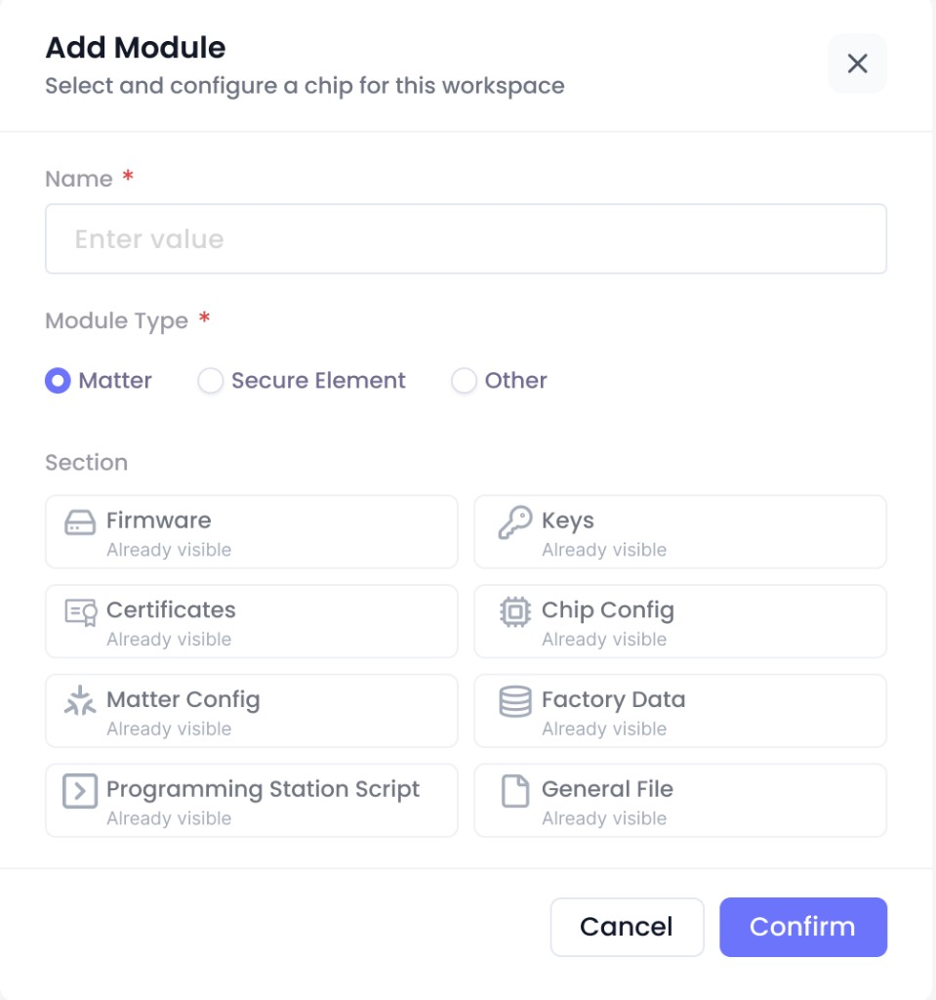
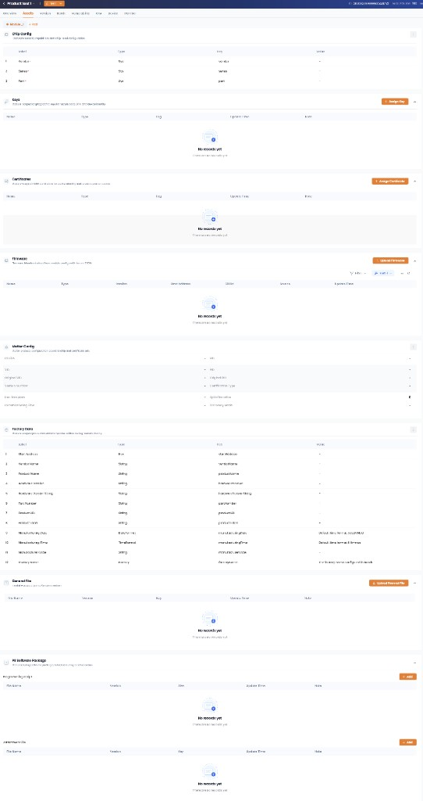

# Story: 【卡片编辑】选择module类型

**来源**: [飞书项目 User Story #7013300594](https://project.feishu.cn/obis/userstory/detail/7013300594)
**空间**: OBIS (`obis`)
**类型**: User Story
**编号**: 601
**状态**: 待排期
**优先级**: Must
**Sprint**: OBIS-20260622-20260703
**Story Point**: 1 (QC)
**创建**: 2026-06-09
**更新**: 2026-06-25

---

## 需求描述（Product Doc）

### 1. Module Type 选择

- 增加 Module 时新增字段 **Module Type**：**单选**、**必填**。
- 枚举值：**Matter** / **Secure Element** / **Other**。
- 默认值：**Matter**。

**设计规格（来自参考图 ref-add-module-dialog-matter — Add Module 弹框）**：

- **入口**：Assets Tab → Module 选择器旁 **Add** → 弹出 **Add Module** 对话框。
- **弹框结构**：
  - 标题：**Add Module**
  - 副标题：**Select and configure a chip for this workspace.**
  - 右上角 **关闭（X）**
  - **Name**（必填 `*`，placeholder：`Enter value`）
  - **Module Type**（必填 `*`，**Radio 单选**）：Matter（默认选中）/ Secure Element / Other
  - **Section**：根据所选 Module Type 展示默认卡片预览（2×4 网格）；每张卡片含图标、标题、副文案 **Already visible**（表示创建后将默认出现在 Assets）
  - 底栏：**Cancel** / **Confirm**
- **Matter 选中时 Section 预览卡片**（8 张，均为 Already visible）：

| 列 | 卡片标题（弹框） | 对应 Assets 卡片 | 需求简称 |
|:--:|-----------------|-----------------|---------|
| 左 1 | Firmware | Firmware | firmware |
| 左 2 | Certificates | Certificate | cert |
| 左 3 | Matter Config | Matter Config | matter config |
| 左 4 | Programming Station Script | PS Software Package | 脚本 |
| 右 1 | Keys | Keys | key |
| 右 2 | Chip Config | Chip Config | chip config |
| 右 3 | Factory Data | Factory Data | fc data |
| 右 4 | General File | General File | General File |

- **弹框 vs Assets 命名差异**：弹框用 **Certificates**、**Programming Station Script**；Assets 页分别展示为 **Certificate**、**PS Software Package**（同一卡片，UI 文案略有不同）。
- **Secure Element / Other**：切换 Module Type 后 Section 预览内容待补截图；规则见 §4.2 / §4.3。

### 2. Module 编辑

- Module 增加 **编辑**按钮，点击可 **编辑名称**。

### 3. 创建产品时的默认 Module

- 创建产品时，默认添加的 Module 为 **Matter** 类型。

### 4. Module Type 与 Assets 卡片规则

选择不同 Module Type 时，Assets 中对应 Module 的 **默认卡片** 与 **不可删除 / 必填规则** 不同。

**术语（来自产品评论确认）**：

- **不可删除项**：在该 Module 模板下 **无法删除** 的卡片。
- **必填项（作用于卡片）**：**创建 Product Version** 时，校验该 Module 下指定 **卡片数据是否充分**；若必填卡片（如 **chip config**、**matter**）**未填写 / 数据不完整**，则该 Module **不会出现在 Version 可选 Module 列表中**（不可被选中纳入本次 Version 创建）。
- **引用保护**：当某个 **密钥或证书** 被引用时，对应卡片在 **取消引用之前** 也无法删除。

#### 4.1 Matter

| 规则 | 内容 |
|------|------|
| 默认卡片 | **保持现状**（见下方 baseline；与不可删除项一一对应，共 **8** 张） |
| 不可删除项 | chip config、matter config、key、cert、firmware、fc data、脚本、General File |

**设计规格（来自参考图 ref-matter-default-cards，SIT 样本 Product test 1 / Module_1）**：

- **页面路径**：Product Workspace → Product → **Assets** Tab；Module 选择器（如 `Module_1`）+ **Add** 按钮。
- **默认卡片自上而下固定顺序**（8 张内置卡片）：

| 序号 | UI 卡片标题 | 需求文档简称 | 主要控件 / 内容 |
|:----:|------------|-------------|----------------|
| 1 | **Chip Config** | chip config | Index / Type / Key / Value 表格；样本行：vendor、sensor、fan |
| 2 | **Keys** | key | **Assign Key**；表格列：Name / Type / Key / Update Time / Note |
| 3 | **Certificate** | cert | **Assign Certificate**；表格列同上 |
| 4 | **Firmware** | firmware | **Upload Firmware**、Filter、**Batch Edit**；表格列：Name / Type / Version / Description / Size / Status / Update Time |
| 5 | **Matter Config** | matter config | 双列表单：VID、PID、Origin VID/PID、Serial Number、Certification Type、Disc. Tool Start、Updatable value、Commissioning Flow、Discovery mode 等 |
| 6 | **Factory Data** | fc data | Index / Type / Key / Value / Note 表格；含 dac_certificate、vendor_name、product_name、hardware_version、manufacturing_date/time 等 |
| 7 | **General File** | General File | **Upload General File**；表格列：File Name / Version / Key / Update Time / Note |
| 8 | **PS Software Package** | 脚本 | 两个子区块：**Programming script**、**Assessment file**；各有 **Add** 按钮与 File Name / Version / Key / Update Time / Note 表格 |

- **与不可删除项对照**：上述 8 张默认卡片与 Product Doc 不可删除项 **完全对应**；Matter Module 下这 8 张卡片均不可删除（另受 Story #602 引用保护 / 已进版本等规则约束）。

#### 4.2 Secure Element

| 规则 | 内容 |
|------|------|
| 默认卡片 | **SE**、脚本、General File |
| 不可删除项（创建版本时必填） | **SE**（机制同「必填项」：SE 卡片数据不充分则 Module 不出现在 Version 可选列表） |
| 引用保护 | 密钥或证书被引用时，对应卡片取消引用前不可删除 |

#### 4.3 Other

| 规则 | 内容 |
|------|------|
| 默认卡片 | Matter「保持现状」**减去 Matter Config**（共 **7** 张；见下方设计说明） |
| 不可删除项（创建版本时必填） | **无** |
| 引用保护 | 密钥或证书被引用时，对应卡片取消引用前不可删除 |
| 必填项（作用于卡片） | **chip config**；**matter**（仅当 Module 内 **存在 Matter Config 卡片** 时校验） |

**默认 7 张卡片**（= Matter §4.1 去掉 Matter Config）：Chip Config、Keys、Certificate、Firmware、Factory Data、General File、PS Software Package。

**设计说明（Other 不含 Matter Config 的原因，产品确认）**：

- Product Doc 定义 **matter**（Matter Config 卡片数据）为创建 Version 时的 **必填项**之一。
- **大部分 Other 用户不使用 Matter Config**；若默认带上该卡片且 matter 必填，则卡片存在但数据未填时，会导致该 Module **无法纳入 Version 创建**（不出现在可选 Module 列表）。
- 因此 Other **默认不展示 Matter Config 卡片**，避免「不需要 Matter 的用户被空卡片拦住」。
- **需要 Matter 的用户**：可通过 Story #602 新增内置卡片流程 **手动加回 Matter Config**，加回后须填写完整 matter 数据，该 Module 方可出现在 Version 可选列表中。
- **chip config** 仍在默认卡片中且为必填：未填充分则 Module 同样不出现在 Version 可选列表。

**创建 Version 校验规则（Other）**：

| 卡片 | 默认是否存在 | Version 校验 |
|------|:-----------:|-------------|
| chip config | ✅ | **必填**；数据不充分 → Module 不可选 |
| matter（Matter Config） | ❌ 默认无 | **仅当卡片已添加时** 校验必填；未添加则不校验 |

### 5. UI 设计

- Figma：[OBIS-Planning 设计稿 — Module Type](https://www.figma.com/design/GomFi4IUgj6MTO7S73h26Q/OBIS-Planning%E8%AE%BE%E8%AE%A1%E7%A8%BF%E6%96%87%E4%BB%B6?node-id=11874-168328&t=bLle2QDoWPlGrht6-4)

---

## 评论 / 待确认

- **[2026-06-25] 术语澄清**：「不可删除项」= 模板下无法删除的卡片；「必填项」= 创建 Version 时校验卡片数据充分性，不充分则 Module 不出现在 Version 可选列表（见 §4 术语）。
- **[2026-06-25] Other 默认不含 Matter Config**：因 matter 为 Version 必填项，而多数 Other 用户不用 Matter；默认带空卡片会阻断 Version 创建，故默认去掉；需 Matter 的用户手动加回 Matter Config 卡片（见 §4.3 设计说明）。
- **UI 规格**：Add Module 弹框见 §1 参考图；Matter Assets 默认卡片布局见 §4.1；Module 编辑入口以 Figma 设计稿为准。
- **Add Module Section（SE / Other）**：Secure Element、Other 选中时的 Section 预览卡片清单待补 UI 截图。
