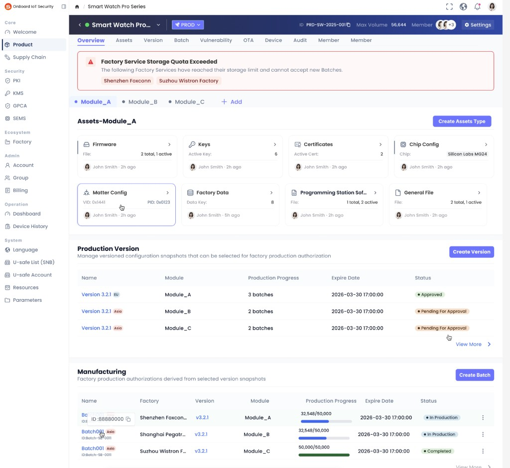

# Story: 【卡片编辑】overview展示内容改动

**来源**: [飞书项目 User Story #7013841136](https://project.feishu.cn/obis/userstory/detail/7013841136)
**空间**: OBIS (`obis`)
**类型**: User Story
**编号**: 627
**状态**: 待排期
**优先级**: Must
**Sprint**: OBIS-20260622-20260703
**Story Point**: 0.5 (QC)
**创建**: 2026-06-10
**更新**: 2026-06-25

---

## 需求描述（Product Doc）

### 1. Overview 与 Assets 卡片同步

- **Overview** 页的资产卡片须随 **Assets** 中卡片的 **删除** 与 **新增** **同步改动**（增删保持一致）。

### 2. Overview 卡片展示内容 — 按卡片类型

| 卡片类型 | Overview 展示内容 |
|---------|------------------|
| **SE** | **name**（Product Doc） |
| **Custom（自定义）** | **data volume = 行数**（自定义卡片字段行表行数） |
| **内置卡片（Matter 等）** | 展示**摘要统计 / 关键字段** + 最近编辑者与时间（见下方参考图样本） |

**设计规格（来自参考图 ref-overview-ui — Overview Tab 样本）**：

- **页面路径**：Product Workspace → Product 详情 → **Overview** Tab。
- **Product 级 Tab**：Overview（当前）、Assets、Version、Batch、Vulnerability、OTA、Device、Audit、Member。
- **Module 选择器**：横向 Tab（如 Module_A / Module_B / Module_C）+ **Add**；切换 Module 后下方 **Assets-{Module名}** 区块联动切换。
- **Assets 卡片区标题**：`Assets-{Module名}`（样本为 **Assets-Module_A**）。
- **卡片布局**：网格卡片（样本为 **2 行 × 4 列**）；每张卡片含 **图标**、**卡片标题**、**摘要内容**、底栏 **{编辑者} - {相对时间}**（样本：`John Smith - 2h ago`）。

**Matter 内置卡片 Overview 摘要（样本 Module_A，供测试 baseline）**：

| 卡片标题（Overview） | 摘要展示（样本） |
|---------------------|-----------------|
| **Firmware** | `2 total, 1 active` |
| **Keys** | `6 active keys` |
| **Certificates** | `2 active certs` |
| **Chip Config** | `Chip: Silicon Labs MG24` |
| **Matter Config** | `VID: 0x1441`；`PID: 0x0123`（两行） |
| **Factory Data** | `8 data keys` |
| **Programming Station Software** | `1 total, 2 active` |
| **General File** | `2 total, 1 active` |

> Overview 卡片标题 **Programming Station Software** 对应 Assets 页 **PS Software Package**（命名差异同 Story #601）。

### 3. Overview 创建卡片

- Overview 页 **Assets-{Module}** 区块右上方增加 **Create Assets Type** 按钮（Product Doc 称「创建卡片」）。
- 点击后弹出 **新建卡片** 弹窗（与 Assets Tab 新增卡片流程的关系待确认，见「评论 / 待确认」）。

### 4. 同页其他区块（本 Story 不改动，供上下文）

- **Production Version**：含 **Create Version** 按钮与版本列表（Module、Status 等）。
- **Manufacturing**：含 **Create Batch** 按钮与批次列表。
- 顶部可存在 **告警横幅**（样本：Factory Service Storage Quota Exceeded）。

---

## 评论 / 待确认

- **内置卡片 Overview 摘要规则**：参考图已给出 Matter 8 卡样本文案格式；是否所有环境统一该格式、空态如何展示，待产品确认。
- **SE / Custom Overview 展示**：Product Doc 规定 SE 显示 name、Custom 显示 data volume；参考图为 Matter Module，**无 SE / Custom 样本**。
- **「Create Assets Type」弹窗**：是否与 Assets Tab 新增卡片（内置 / 自定义，Story #602 / #603）为同一弹窗/同一流程，待产品或 UI 确认。
- **data volume 计数规则**：Custom 卡片「行数」是否含空行、是否仅统计已保存行、删除行后是否实时更新，待开发或产品补充。
- **编辑者与时间**：Overview 卡片底栏 `{用户} - {相对时间}` 的数据来源与更新时机 Product Doc 未述。

## 关联 Story

| 编号 | Story | 关系 |
|:----:|-------|------|
| 602 | assets 卡片自定义 | Assets 侧卡片增删；Overview 须同步 |
| 603 | 自定义卡片 | Custom 类型卡片与 data volume 展示 |
| 653 | SE 卡片内容说明 | SE 卡片 name 字段来源与展示 |
