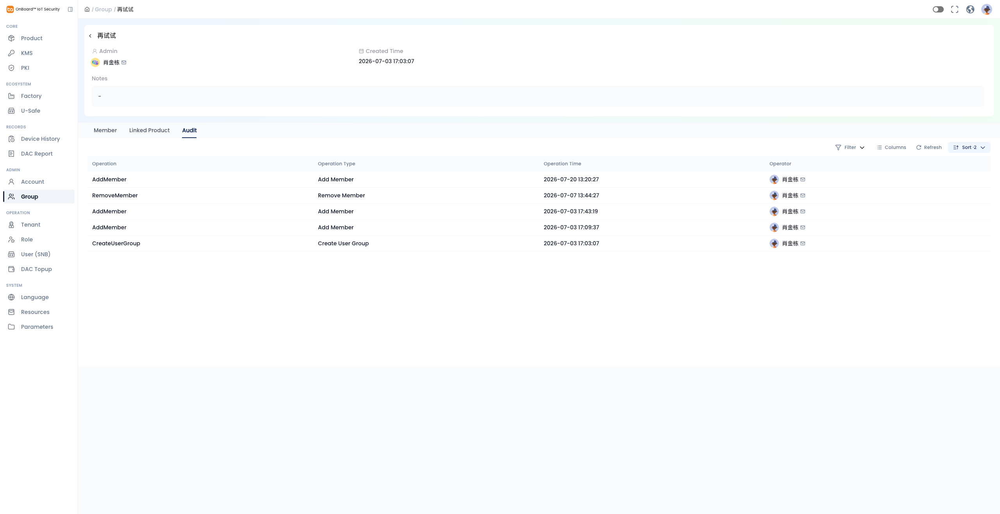
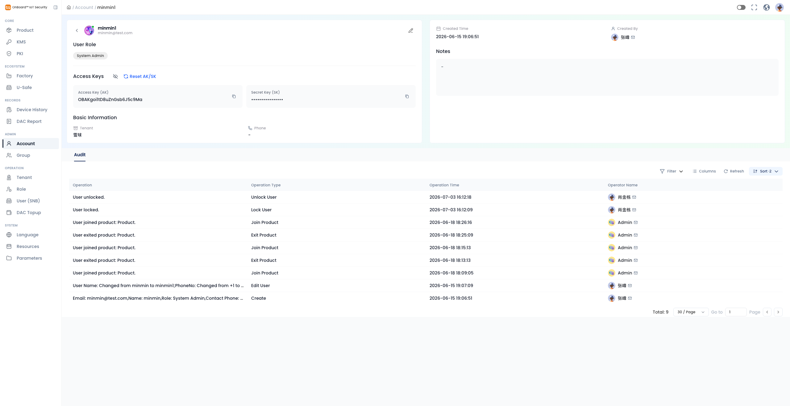
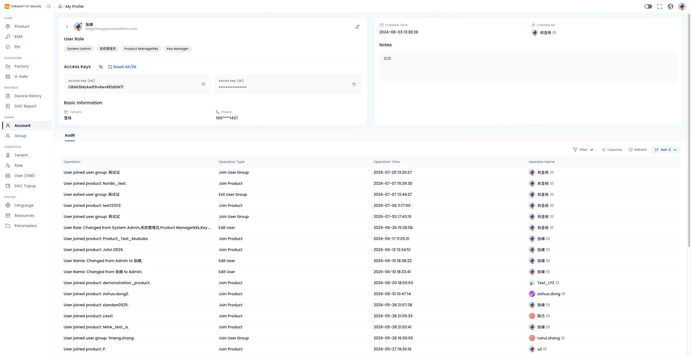
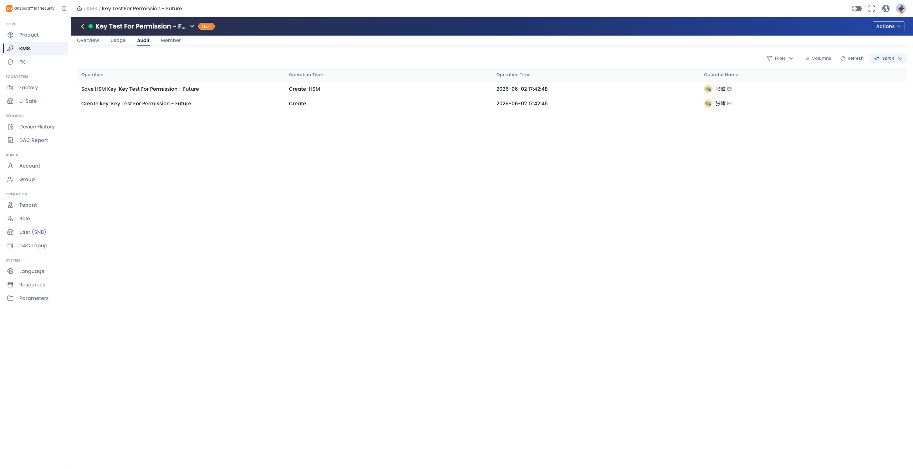
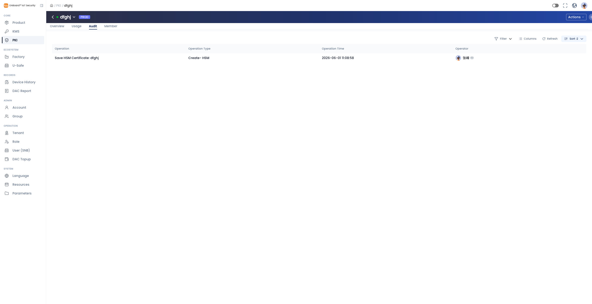
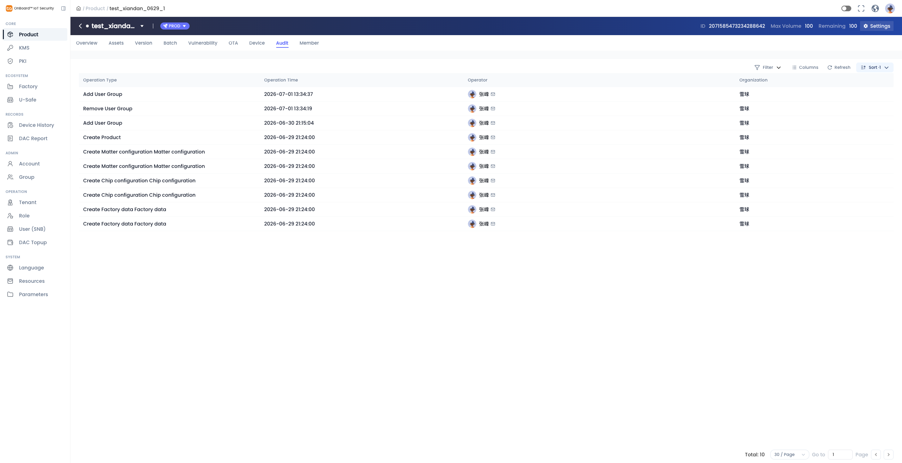

# Story: 【体验优化P2】Audit功能统一

**来源**: [飞书项目 User Story #7029049092](https://project.feishu.cn/obis/userstory/detail/7029049092)
**空间**: OBIS (`obis`)
**类型**: User Story
**编号**: 745
**状态**: 待排期
**优先级**: Must
**Sprint**: OBIS-20260727-20260807
**Epic**: UI及体验优化 (#7018945691)
**Story Point**: QC 2
**创建**: 2026-06-25
**更新**: 2026-07-28

---

## 需求描述（Product Doc）

> Product Doc 字段为空；以下内容来自 **Description**。  
> 目标：对系统内所有日志列表（Audit）的展示需求进行统一。  
> **Group** 为基准规格；Account / Profile / PKI / Product 与 Group 完全一致；KMS 在 Filter 上多一项 Operation Type。  
> 黄色高亮为本次明确变更点（如 Organization 列）。

### 1. 统一基准（以 Group Audit 为准）

适用于各模块详情页 **Audit** Tab 的日志列表。

#### 1.1 列表展示字段

| 字段 | 说明 |
|------|------|
| **Operator / 操作人** | 头像 + Name + 邮箱 icon；鼠标 hover 展示完整邮箱 + 复制按钮 |
| **Organization / 所属组织**（新增） | 展示操作人所属租户简称 |
| **Operation Type / 操作类型** | — |
| **Operation Time / 操作时间** | 年月日时分秒 |
| 溢出内容 | 显示不下时，hover 小窗展示完整内容 |

#### 1.2 Filter

| 筛选项 | 控件 | 说明 |
|--------|------|------|
| Operator Name / 操作人姓名 | 输入框 | Placeholder：`Please Enter / 请输入` |
| Operator Email / 操作人邮箱 | 输入框 | Placeholder：`Please Enter / 请输入` |
| Organization / 所属组织 | 输入框 | 按操作人所属租户简称筛选；Placeholder：`Please Enter / 请输入` |
| Operation Time / 操作时间 | 时间范围 | Start date：选定日期 **00:00:00**；End date：选定日期 **23:59:59** |

#### 1.3 Columns

| 列 | 规则 |
|----|------|
| Operator / 操作人 | **不可隐藏，不可换顺序** |
| Organization / 所属组织 | 可配置 |
| Operation Type / 操作类型 | **不可隐藏，不可换顺序** |
| Operation Details / 操作详情 | **默认隐藏**；位置在 Operation Type **后面一列**；**已确认**：即现状图中的「Operation」长文案列（展示文案/格式沿用现状） |
| Operation Time / 操作时间 | 可配置 |

#### 1.4 其他工具栏

- **Refresh**：刷新列表
- **Sort**：只按 Operation Time 排列；**默认倒序**

---

### 2. Group — Audit

- 规格：**§1 基准**（完全按上表）

- **设计规格（来自参考图 ref-01，现状）**：
  - 页面：Admin → Group → 某 Group 详情 → **Audit** Tab（同页还有 Member / Linked Product）
  - 工具栏：Filter、Columns、Refresh、Sort
  - **当前列**：Operation、Operation Type、Operation Time、Operator（头像 + 姓名 + 邮件 icon）
  - 本次改造要点：列语义对齐基准（Operator / Organization / Operation Type / Operation Time）；现状「Operation」列 = 目标 **Operation Details**（默认隐藏）；新增 Organization；Operator hover 出完整邮箱 + 复制

---

### 3. Account — Audit

- 规格：**与 Group 完全一致**

- **设计规格（来自参考图 ref-02，现状）**：
  - 页面：Admin → Account → 某账号详情 → **Audit** 区域
  - 工具栏同 Group；当前列：Operation、Operation Type、Operation Time、Operator Name
  - 改造目标同 §1（含 Organization、Columns 规则、Filter、Sort）

---

### 4. Profile — Audit

- 规格：**与 Group 完全一致**

- **设计规格（来自参考图 ref-03，现状）**：
  - 页面：My Profile（或等价个人资料页）→ **Audit** 区域
  - 工具栏同 Group；当前列：Operation、Operation Type、Operation Time、Operator Name
  - 改造目标同 §1

---

### 5. KMS — Audit

- 规格：与 Group 一致，**Filter 面板内额外增加**：
  - **Operation Type / 操作类型**
  - 入口：列表上方工具栏的 **Filter** 按钮（点击展开筛选项，非列表内独立控件）
  - 筛选项位置：放在 **Organization 后面一个**
- 列表列、Columns、Refresh、Sort 等同 §1

- **设计规格（来自参考图 ref-04，现状）**：
  - 页面：KMS 资源详情 → **Audit** Tab（Overview / Usage / Audit / Member）
  - 当前列：Operation（= Operation Details）、Operation Type、Operation Time、Operator Name
  - 改造目标同 §1，并在 Filter 按钮展开面板中补 Operation Type

---

### 6. PKI — Audit

- 规格：**与 Group 完全一致**

- **设计规格（来自参考图 ref-05，现状）**：
  - 页面：PKI 资源详情 → **Audit** Tab
  - 当前列：Operation、Operation Type、Operation Time、Operator
  - 改造目标同 §1

---

### 7. Product — Audit

- 规格：**与 Group 完全一致**

- **设计规格（来自参考图 ref-06，现状）**：
  - 页面：Product 详情 → **Audit** Tab（同页还有 Overview / Assets / Version / Batch / Vulnerability / OTA / Device / Member 等）
  - 工具栏：Filter、Columns、Refresh、Sort
  - **当前列**：Operation Type、Operation Time、Operator、Organization（已有 Organization，需与基准字段/交互对齐）
  - 改造目标同 §1：补齐 Operator hover 邮箱复制、Operation Details 默认隐藏、Filter/Columns/Sort 规则统一等

---

## 模块对照摘要

| 模块 | 相对 Group 基准 |
|------|-----------------|
| Group | 基准 |
| Account | 完全一致 |
| Profile | 完全一致 |
| PKI | 完全一致 |
| Product | 完全一致 |
| KMS | 一致 + Filter 按钮面板内增加 Operation Type（Organization 后） |

---

## 评论 / 已确认

- 无飞书评论。
- 现状「Operation」列 = 目标 **Operation Details**（默认隐藏）；展示文案/格式沿用现状。
- KMS 的 Operation Type 筛选项：放在列表上方 **Filter** 按钮展开的筛选面板中（Organization 后一项）。

## 评论 / 待确认

- KMS Filter 内 Operation Type：控件类型（单选 / 多选 / 输入）及可选值来源未写清。
- Organization Filter 为输入框：是否支持模糊匹配？空组织如何展示与筛选？
- Operator 不可换顺序：与 Organization / Operation Type / Operation Details / Operation Time 的**默认列顺序**是否固定为 §1.1 表顺序？
- Profile Audit 与 Account 详情 Audit 是否共用同一组件与同一套列配置？

## Out of Scope

- （原文未划删除线项；若后续明确排除再补）
