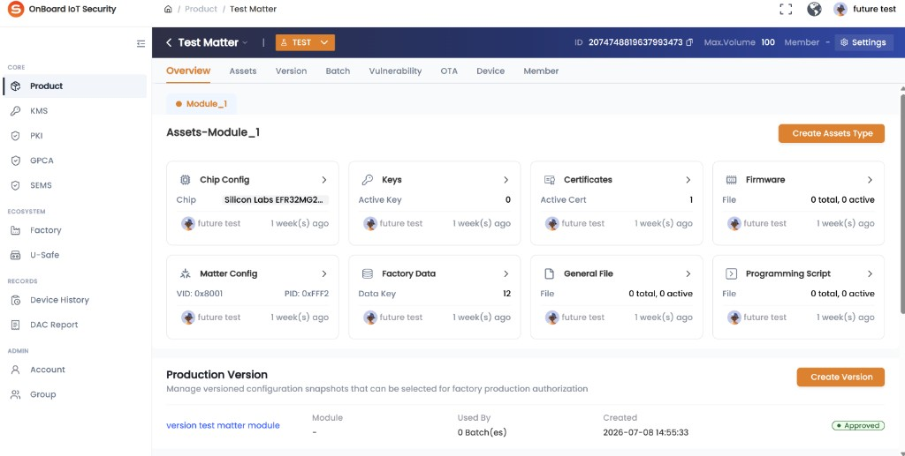
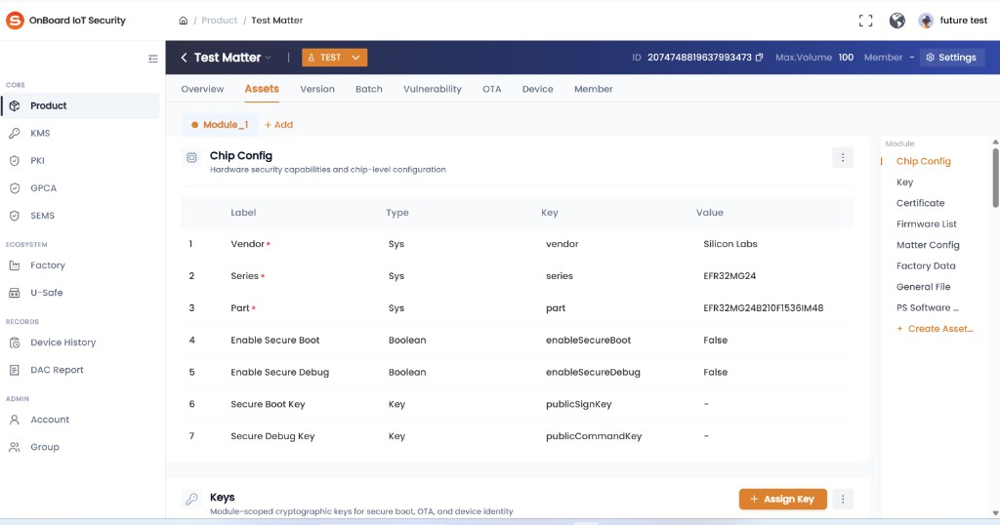

# Story: 权限说明：只有 product manager；resource manager 有创建 module 权限

**来源**: [飞书项目 User Story #7041825174](https://project.feishu.cn/obis/userstory/detail/7041825174)
**空间**: OBIS (`obis`)
**类型**: User Story
**编号**: 778
**状态**: 开发中
**优先级**: Must
**Sprint**: OBIS-20260706-20260717
**Epic**: （未填写）
**Story Point (QC)**: 0.6
**Story Point (DEV)**: 1
**创建**: 2026-07-08
**更新**: 2026-07-15（补充页面截图识读与入口映射确认）

---

## 需求描述（Product Doc）

> Description 字段为空；Product Doc 原文极短。以下合并原文 + 用户提供的页面截图识读与确认结论。

### 1. 权限说明（原文）

只有 **Product Manager**、**Resource Manager**（原文拼写 `resouce manager`）具备以下权限：

- 创建 Module
- Add Asset Type

### 2. 页面入口（截图 + 已确认映射）

**路径**：`Product` → 进入具体产品详情（示例产品名 `Test Matter`，环境标签 `TEST`）

产品详情顶栏 Tab：`Overview` | `Assets` | `Version` | `Batch` | `Vulnerability` | `OTA` | `Device` | `Member`

#### 2.1 Overview Tab

- Module 子 Tab 行：已有模块（如 `Module_1`、`Module_2`）+ 右侧橙色 **`+ Add`**
  - **已确认**：`+ Add` = 「创建 Module」入口
- Assets-Module 区域右上角橙色按钮：**`Create Assets Type`**
  - **已确认**：`Create Assets Type` = 需求「Add Asset Type」
- 同页还有 `Create Version`（Production Version），**不在本 Story 原文权限范围内**（除非产品声明一并管控）

#### 2.2 Assets Tab

- Module 子 Tab 行同样有 **`+ Add`**（与 Overview 同为创建 Module）
- 右侧锚点菜单底部有 **`+ Create Asset...`**
  - **已确认**：与 Overview `Create Assets Type` 为**同一权限、同一动作**（两处入口等价）

### 3. 权限 × 入口矩阵（已确认部分）

| 能力（需求原文） | UI 入口 | 允许角色 | 确认状态 |
|------------------|---------|----------|----------|
| 创建 Module | Overview / Assets 的 Module 行 **`+ Add`** | Product Manager、Resource Manager | ✅ 入口映射已确认 |
| Add Asset Type | Overview **`Create Assets Type`** ≡ Assets **`+ Create Asset...`** | Product Manager、Resource Manager | ✅ 入口映射与双入口等价已确认 |

- 其他角色：应**不可见或不可用**上述入口（隐藏 / 置灰 / 403 **仍未定义**）

---

## Tech Doc

- 无

## 评论 / 待确认

- 无飞书评论
- [2026-07-15] **已确认**：`+ Create Asset...` 与 `Create Assets Type` 为同一权限、同一动作。
- [2026-07-15] **已确认**：`+ Add` = 「创建 Module」；`Create Assets Type` = 「Add Asset Type」。
- **仍缺失**：无权限表现、完整角色矩阵、正式 AC（见下方）。

## Out of Scope（暂定）

- `Create Version` / Production Version 创建权限（截图可见但原文未提）
- Assets 内 `+ Assign Key`、Chip Config 编辑等资源操作权限（原文未提）
- Product 列表「新建产品」权限

---

## 需补充信息（阻塞验收 / 测试设计）

### 已关闭

- [x] 页面位置：Product 详情 → Overview / Assets
- [x] `+ Add` = 创建 Module
- [x] `Create Assets Type` = Add Asset Type
- [x] `+ Create Asset...` ≡ `Create Assets Type`（同一权限、同一动作）

### 仍必须向产品确认

| # | 待补充项 | 说明 |
|---|----------|------|
| 1 | **无权限表现** | 隐藏按钮 / 置灰 / 可点后 Toast·403？Overview 与 Assets 各入口是否表现一致？ |
| 2 | **完整角色矩阵** | System Manager、Factory Manager、Normal User、Tenant Admin 等对 `+ Add` / `Create Assets Type` / `+ Create Asset...` 的表现 |
| 3 | **多角色叠加** | 多角色时权限是否取并集？ |
| 4 | **Role 权限码** | 是否对应 Role 树固定权限项？正式名称？超管可否改？ |
| 5 | **是否仅「创建」** | Module / Asset Type 的编辑、删除、查看是否另有权限？ |
| 6 | **正式 AC** | 至少：有权限可见可成功创建；无权限不可创建（含表现方式） |
| 7 | **边界** | 重复创建、Module 数量上限、无权限接口绕过是否拦截 |
| 8 | **中文文案** | `+ Add` / `Create Assets Type` / `+ Create Asset...` 中文环境文案 |

---

## 当前可暂定的验收草稿（无权限表现确认前仍非正式 AC）

1. Product Manager、Resource Manager 在 Product 详情 Overview / Assets 可见并可用 `+ Add`，可成功创建 Module。
2. Product Manager、Resource Manager 可用 Overview `Create Assets Type` 与 Assets `+ Create Asset...`（等价）完成 Add Asset Type。
3. 其他角色对上述入口不可用（具体表现 TBD）。
4. `Create Version` 等不在本 Story 原文范围内。
