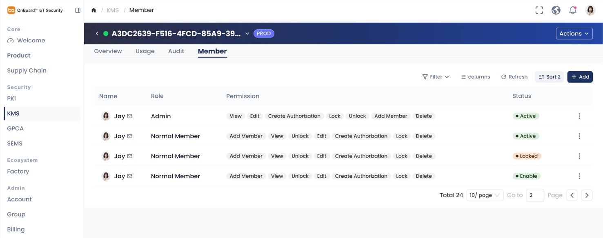
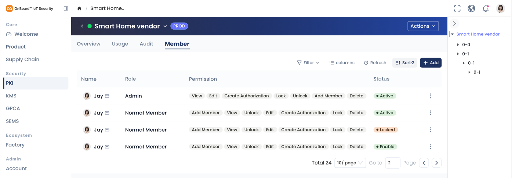
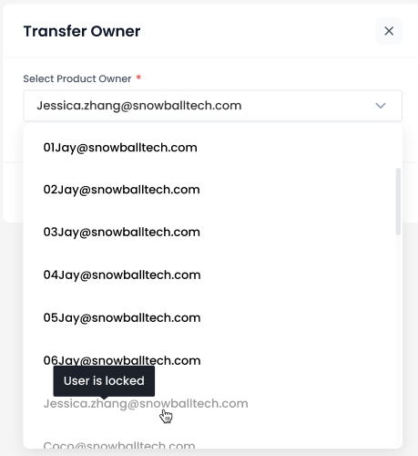
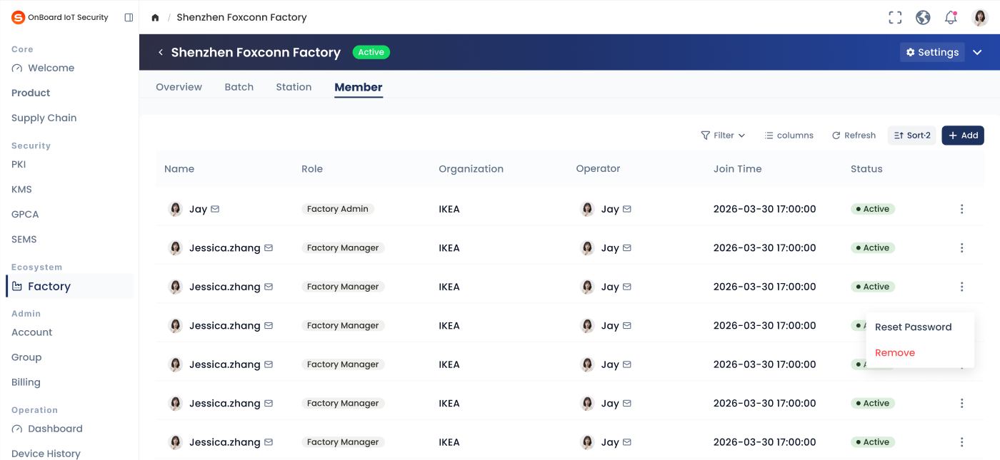
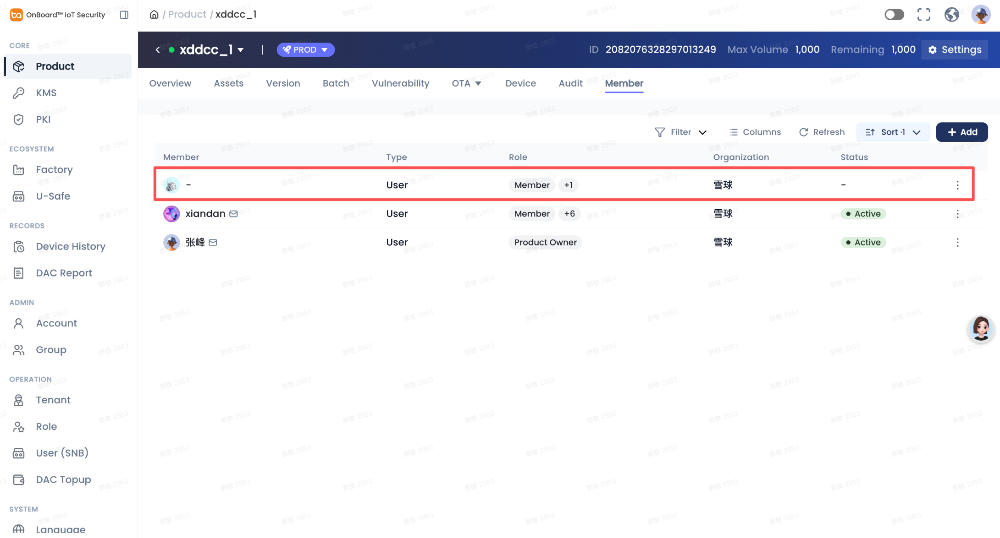
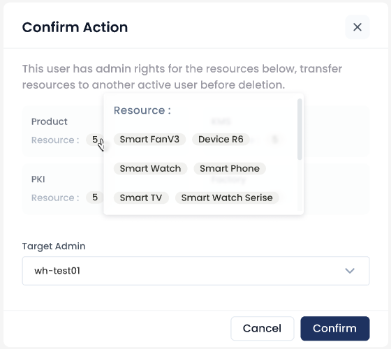

# Story: 【体验优化P2】Member功能统一

**来源**: [飞书项目 User Story #7042512337](https://project.feishu.cn/obis/userstory/detail/7042512337)
**空间**: OBIS (`obis`)
**类型**: User Story
**编号**: 780
**状态**: 待排期
**优先级**: Must
**Sprint**: OBIS-20260727-20260807
**Epic**: UI及体验优化 (#7018945691)
**Story Point**: QC 2 / DEV 2
**创建**: 2026-07-08
**更新**: 2026-07-30

---

## 需求描述（Product Doc）

> Product Doc 字段为空；以下内容来自 **Description**。  
> 背景：涉及 Member 管理的模块有 Product、KMS、PKI、Factory、Group，共通逻辑需统一。  
> 文中高亮（黄色背景）为本次明确变更点。

### 1. KMS — Member 列表

- **默认展示字段**：
  - Name
  - Role
  - **Permission / 权限**（样式调整）：默认展示 1 个，其余用 `+n` 展示；hover 展示全部 Permission  
    - 参考样式：[Figma node 16905-199565](https://www.figma.com/design/GomFi4IUgj6MTO7S73h26Q/OBIS-Planning%E8%AE%BE%E8%AE%A1%E7%A8%BF%E6%96%87%E4%BB%B6?node-id=16905-199565)
  - **Organization / 组织**（新增字段）：展示租户简称；列顺序放在 Permission 后一列
  - Status：展示用户 Account 状态
- **转移操作（Admin）**：
  - Admin 行 Operation 展开后**仅保留** `Transfer Admin / 转移管理员`，其他操作去掉
  - 权限：仅 Admin **自己**可操作（亮起）；其他用户看到该按钮置灰，hover 提示 `No Permission / 无权限`

- **设计规格（来自参考图 ref-01）**：
  - 页面：KMS 资源详情 → **Member** Tab（同页还有 Overview / Usage / Audit）
  - 工具栏：Filter、Columns、Refresh、Sort、`+ Add`
  - 当前表可见列示例：Name、Role、Permission（多 Tag）、Status（Active / Locked 等）、行末 `⋮`
  - Permission 当前为多 Tag 平铺；本次改为「默认 1 个 + `+n` hover 全量」
  - Organization 列在截图中尚未出现，属新增

---

### 2. KMS — Transfer Admin 弹窗

- **标题**：`Transfer KMS Admin / 转移密钥管理员`
- **表单 — 选择密钥管理员 / Select KMS Admin**：
  - 必填，右上角 `*`
  - Placeholder：`Please Select / 请选择`
  - 下拉：该租户下已存在的**其他用户**，且状态为 **Active**；显示邮箱
  - 报错：`KMS Admin is required / 密钥管理员是必填项`
- **操作**：
  - **Confirm / 确认**：
    - 将该密钥的 Admin 移交给目标用户；关闭弹窗；Toast：`操作成功 / Operation Successful`
    - 列表刷新后目标用户：
      - 已在 Member list → Role 刷新为 Admin，并授予**全部权限点**
      - 不在 Member list → 新增进列表，Role 为 Admin，授予全部权限点
    - 原 Admin 仍留在 Member list，Role 刷新为 **Normal Member**，权限点不变
  - **Cancel** / 关闭按钮：关闭弹窗，不执行操作
  - 点击弹窗外蒙层：**不可**关闭

- **设计规格（来自参考图 ref-02）**：
  - 参考图为既有 **Transfer Owner** 交互样例（标题/字段文案按上文本模块替换）
  - 弹窗：标题 + 右上角关闭；单一下拉必填字段；底部无额外说明区
  - 下拉仅展示同租户其他 **Active** 用户邮箱（**已确认以正文为准**；参考图中 Locked 置灰 + `User is locked` tooltip **不采纳**）

---

### 3. PKI — Member 列表

- 与 KMS 列表规则对齐：
  - 默认列：Name、Role、**Permission（1 个 + `+n` hover）**、**Organization（新增，Permission 后）**、Status
  - Admin Operation：仅 `Transfer Admin / 转移管理员`；仅本人可操作，他人置灰 + `No Permission / 无权限`
  - Permission `+n` 样式同 [Figma node 16905-199565](https://www.figma.com/design/GomFi4IUgj6MTO7S73h26Q/OBIS-Planning%E8%AE%BE%E8%AE%A1%E7%A8%BF%E6%96%87%E4%BB%B6?node-id=16905-199565)

- **设计规格（来自参考图 ref-03）**：
  - 页面：PKI 资源详情 → **Member** Tab
  - 表结构与 KMS 类似；Permission 当前多 Tag 平铺，本次改为 `+n` 折叠
  - Organization 列待新增

---

### 4. PKI — Transfer Admin 弹窗

- **标题**：`Transfer PKI Admin / 转移证书管理员`
- **表单 — 选择证书管理员 / Select Certificate Admin**：
  - 必填 `*`；Placeholder：`Please Select / 请选择`
  - 下拉：同租户其他 **Active** 用户，显示邮箱
  - 报错：`Certificate Admin is required / 证书管理员是必填项`
- **Confirm 后**：
  - 移交该证书 Admin；Toast 成功；关闭弹窗
  - 目标用户：已在列表则 Role→Admin 且全部权限点；不在则新增为 Admin 并授予全部权限点
  - 原 Admin 仍在列表，Role→**Normal Member**，权限点不变
- Cancel / 关闭按钮关闭且不执行；蒙层不可关闭

- **设计规格（来自参考图 ref-04）**：同 Transfer Owner 交互样例，文案按 PKI 替换；下拉范围同 KMS（仅 Active，不采纳图中 Locked 交互）

---

### 5. Factory — Member 列表

- **默认展示字段**：Name、Role、Status（Account 状态）
- **默认隐藏字段**（可通过 Columns 打开）：
  - Organization → 改为默认隐藏
  - Operator → 改为默认隐藏
  - Join Time → 改为默认隐藏
- **转移操作（Admin）**：
  - Admin 行 Operation 展开可见 **2** 个操作：
    - `Reset Password`
    - `Transfer Admin`（**去掉原来的 Remove**）
  - 以上 2 个操作均仅 Admin **自己**可操作（亮起）；其他用户置灰，hover：`No Permission / 无权限`

- **设计规格（来自参考图 ref-05）**：
  - 页面：Factory 详情 → **Member** Tab（Overview / Batch / Station / Member）
  - 截图当前列含 Name、Role、Organization、Operator、Join Time、Status — 后三列本次改为默认隐藏
  - Admin 行 `⋮` 当前展开为 `Reset Password`、`Remove`（红色）— Remove 替换为 Transfer Admin

---

### 6. Factory — Transfer Admin 弹窗

- **标题**：`Transfer Factory Admin / 转移工厂管理员`
- **表单 — 选择工厂管理员 / Select Factory Admin**：
  - 必填 `*`；Placeholder：`Please Select / 请选择`
  - 下拉：同租户其他 Active 用户，显示邮箱
  - 报错：`Factory Admin is required / 工厂管理员是必填项`
- **Confirm 后**：
  - 移交该工厂 Admin；Toast 成功；关闭弹窗
  - 目标用户：已在列表 → Role 刷新为 **Factory Admin**；不在 → 新增为 Factory Admin
  - 原 Admin 仍在列表，Role 刷新为 **Factory Manager**
- Cancel / 关闭不执行；蒙层不可关闭

- **设计规格（来自参考图 ref-06）**：同 Transfer Owner 交互样例，文案按 Factory 替换；下拉范围同 KMS（仅 Active，不采纳图中 Locked 交互）

---

### 7. Group — 暂不做 Transfer

- 因后续 Group 将做成租户级别，**当前暂不做 Transfer**
- 本次仅需：Group Member list 中，**仅 Admin 用户行**隐藏 Operation 列三个小点（`⋮`）菜单入口；**其余角色行不改**，仍保留三点菜单

---

### 8. Product — Account 删除后 Member 列表清理（评论新增）

- **已知问题**：Account 被删除后，Product Member list 仍可能残留该用户行（Member 显示 `-`、Status 显示 `-` 等空壳数据）。
- **目标**：Account 被删除之后，**Product 的 Member list 应不可见该用户**（不得残留空壳行）。

- **设计规格（来自参考图 ref-08，问题现状）**：
  - 页面：Product 详情 → **Member** Tab
  - 红框行：Member 为 `-`、Status 为 `-`，但仍占一行（Type/Role/Organization 仍有值）— 即 Account 删除后的残留展示，属本条需修复的现象

---

### 9. Account / Account（SNB）— 删除时批量转移（交付范围）

- **触发判断**（删除某用户前，命中**任一**则不可直接删除）：
  - 是否为某个产品的 **Product Owner**
  - 是否为某个密钥的 **Admin**
  - 是否为某个证书的 **Admin**
  - 是否为某个工厂的 **Factory Admin**
- **数据范围（已确认写入 Description）**：
  | 资源状态 | 是否纳入校验 |
  |----------|--------------|
  | 已删除 | 否（不可逆） |
  | 已销毁 | 否（不可逆） |
  | 已归档 | 是（可逆） |
  | 已锁定 | 是（可逆） |
- **命中后弹窗**：
  - 标题：`Confirm Action / 确认操作`
  - 提示：该用户持有以下资源管理员权限，请先将资源转移至其他活跃用户后再删除 / This user has admin rights for the resources below, transfer resources to another active user before deletion.
  - 资源清单：按类型最多 4 卡片 — Product / KMS / PKI / Factory；每卡展示 `Resource / 资源：n`，hover 小窗展示全部资源名称；数量为 0 的卡片不展示
  - **Target Admin / 目标管理员**：必填 `*`；Placeholder `Please Select / 请选择`；同租户其他 **Active** 用户邮箱；报错 `Target Admin is Required / 目标管理员是必填项`
- **操作**：
  - Confirm：将所有命中资源的 Admin 移交给目标用户；Toast 成功；用户被删除；目标用户加入各资源 Member（或已在则刷新 Role/权限）
  - Cancel / 关闭：不执行；蒙层不可关闭

- **设计规格（来自参考图 ref-07）**：Confirm Action 弹窗含资源卡片与 Target Admin 下拉。

---

## 评论 / 已确认

- Transfer 下拉：以正文为准，仅 Active 用户；不采纳参考图 Locked 置灰 + `User is locked`。
- Group：仅 Admin 用户行隐藏三点菜单；其余用户行不需要改。
- **2026-07-29 评论**：解决已知问题 — Account 被删除之后，Product 的 Member list 应不可见该用户（见 §8、ref-08）。
- **2026-07-30 Description**：Account / Account（SNB）删除时批量转移为**交付范围**（见 §9）；资源状态范围：已归档/已锁定需校验，已删除/已销毁不纳入。

## Out of Scope

- Group Transfer 功能（明确暂不做）
