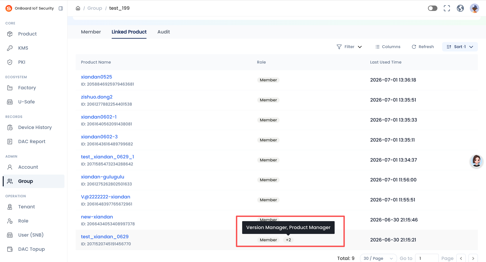
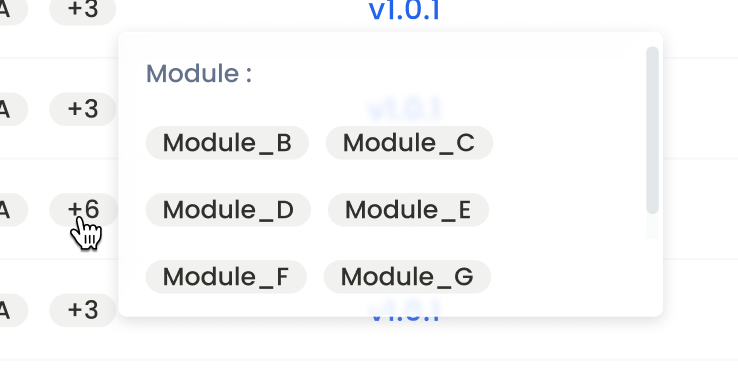
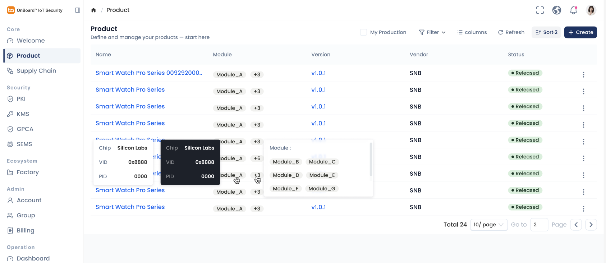
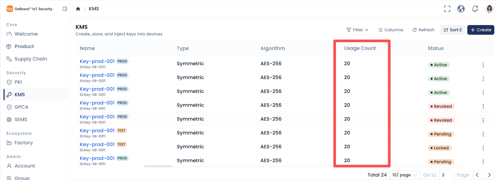
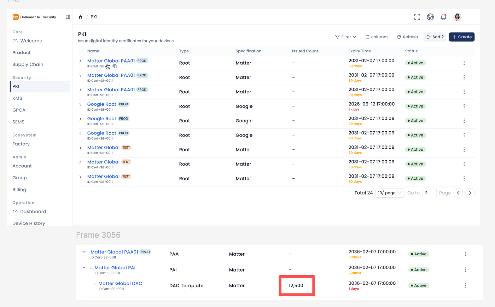
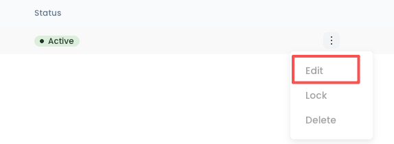
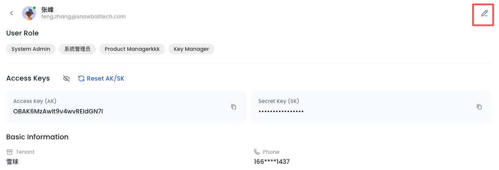
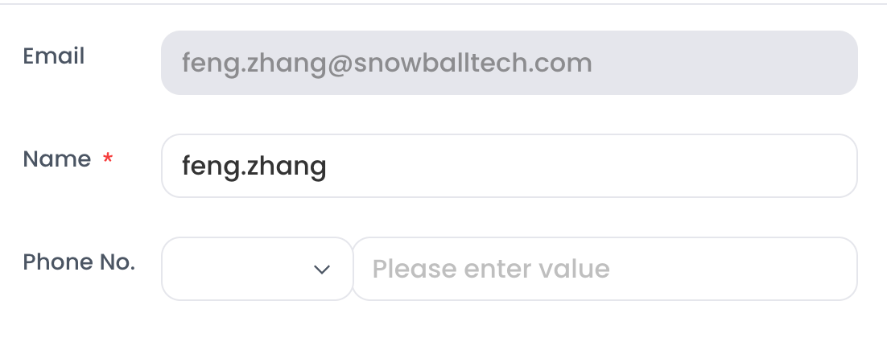
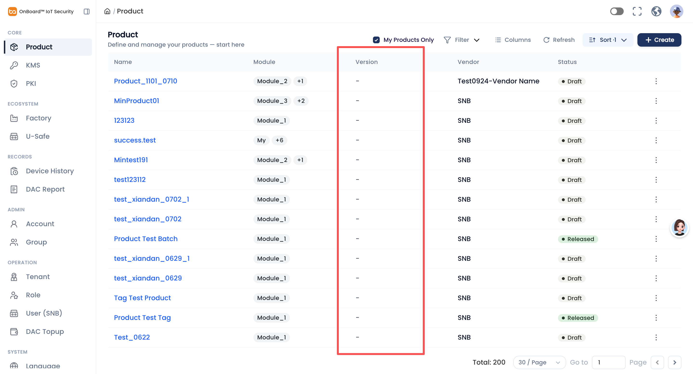
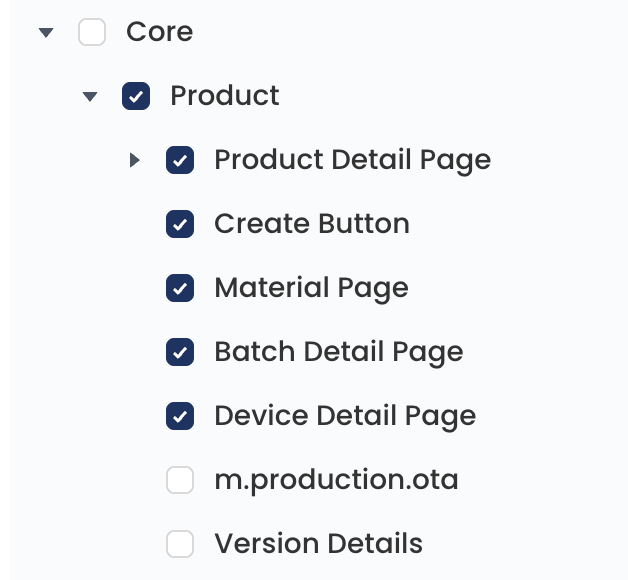

# Story: 【体验优化P2】细节补充

**来源**: [飞书项目 User Story #7051514356](https://project.feishu.cn/obis/userstory/detail/7051514356)
**空间**: OBIS (`obis`)
**类型**: User Story
**编号**: 792
**状态**: 待排期
**优先级**: Must
**Sprint**: OBIS-20260727-20260807
**Epic**: UI及体验优化 (#7018945691)
**Story Point**: QC 3
**创建**: 2026-07-16
**更新**: 2026-07-28

---

## 需求描述（Product Doc）

> Product Doc 字段为空；以下内容来自 **Description**。  
> 背景：对体验优化需求验收过程中，发现效果不好、但此前未在 Story 内具体澄清的内容进行补充。

### 1. 所有 +n 需 hover 小窗展示全部数据

- **规则**：凡界面出现 `+n` 溢出标识，均需支持 hover 小窗展示被折叠的全部数据。
- **本 Story 明确涉及页面**：
  - Account 列表 — **User Role** 列
  - **Account 详情页 — Role** 列（已确认：详情页 Role 亦有 `+n` 展示，需支持 hover 全量）
  - Group 详情页 — **Linked Product** — **Role** 列
- 其他页面若已在对应体验优化 Story 描述过，有遗漏则一并修改。
- Figma：[OBIS-Planning 设计稿 node 11729-146448](https://www.figma.com/design/GomFi4IUgj6MTO7S73h26Q/OBIS-Planning%E8%AE%BE%E8%AE%A1%E7%A8%BF%E6%96%87%E4%BB%B6?node-id=11729-146448)

- **设计规格（来自参考图 ref-01）**：
  - 页面：Admin → Group → 某 Group 详情 → **Linked Product** Tab
  - Role 列示例：`Member +2`；hover `+2` 后出现小窗，文案展示其余角色（示例：`Version Manager, Product Manager`）
- **设计规格（来自参考图 ref-02 / ref-06）**：
  - Product 列表 Module 列：首个 Module 以 Tag 展示，其余以 `+n` 胶囊展示
  - hover `+n` 弹出白底圆角浮层，标题 **Module :**，内部以 Tag 网格列出全部溢出 Module，内容过多时可滚动
  - （ref-06 另含 Module Tag 自身 hover 显示 Chip / VID / PID 详情卡，属同设计稿交互参考）

---

### 2. 操作成功 Toast 样式及文案统一

- 所有成功 Toast（无特殊情况）统一为：
  - 文案：**操作成功 / Operation Successful**
  - 样式：成功态绿色图标 + 浅绿底提示条

- **设计规格（来自参考图 ref-03）**：
  - 截图文案为 **Operation success**；**已确认以正文为准**：英文 **Operation Successful**，中文 **操作成功**（中英文环境分别展示对应文案）
  - 左侧圆形绿色勾选图标，浅绿背景、细绿边框

---

### 3. 所有勾选框颜色改为主题色

- **范围**：所有勾选框，包括 Filter 内、表单下拉框等。
- **目标**：勾选态颜色改成主题色。
- Figma：[node 15959-188662](https://www.figma.com/design/GomFi4IUgj6MTO7S73h26Q/OBIS-Planning%E8%AE%BE%E8%AE%A1%E7%A8%BF%E6%96%87%E4%BB%B6?node-id=15959-188662)

- **设计规格（来自参考图 ref-04 → ref-05）**：
  - 当前：浅蓝/浅紫底圆角方块 + 白色勾
  - 目标：主题色（深蓝）底圆角方块 + 白色勾；旁侧标签文案不变（示例 **Module**）

---

### 4. 列宽调整（大列表固定三列 + 宽窄屏适配）

- 现状：部分列表列宽不合理；已知最大宽度的列可适当缩小，为 Name 等可能较长的列留更大展示空间。
- **所有功能大列表 3 列固定宽度**：
  | 列 | 固定宽度 |
  | --- | --- |
  | 第一列（通常 Name） | **280px** |
  | Status | **160px** |
  | Operation | **64px** |
- **中间非固定列与宽窄屏策略**（前端实现说明，2026-08-06 确认图3方案）：
  - 中间列须设置宽度，否则小屏会挤占中间区域且**不产生滚动条**。
  - **大屏**（宽度足以展示全部列）：固定三列不变，中间列按比例均分剩余宽度（视觉上可宽于固定列）。
  - **小屏**（宽度不足以展示全部列）：固定三列保持宽度不被挤占，出现横向滚动以查看其余列。
- **适用范围**：
  - Product List
  - KMS List
  - PKI List
  - Factory List
  - U-safe list
  - Device History
  - DAC Report
  - Account List
  - Group List
- Figma：[node 11729-146448](https://www.figma.com/design/GomFi4IUgj6MTO7S73h26Q/OBIS-Planning%E8%AE%BE%E8%AE%A1%E7%A8%BF%E6%96%87%E4%BB%B6?node-id=11729-146448)

- **设计规格（来自参考图 ref-06）**：Product 大列表示意（Name / Module / Version / Vendor / Status / Actions），可作为列宽与 Module `+n` 交互的综合参考。

---

### 5. KMS / PKI 列表 Usage Count、Issued Count 样式调整

- **目标**：改为普通文字样式，不需要加图标和边框。
- （原文写「Usage Account、Issue Count」，结合截图列名应为 **Usage Count**、**Issued Count**。）

- **设计规格（来自参考图 ref-07）**：KMS 列表 **Usage Count** 列（红框标注），当前为数字文案（示例 `20`）。
- **设计规格（来自参考图 ref-08）**：PKI 列表 **Issued Count** 列；树形展开至 DAC Template 时可见具体数值（示例 `12,500`）；根级可能显示 `-`。

---

### 6. Account & Profile 编辑（本人可编辑，隐藏部分字段）

1. **背景**
   - 自己能编辑自己，但以下字段不可编辑（编辑态需隐藏）：
     - User Role / 用户角色
     - Notes / 备注
2. **Account 列表、Account（SNB）列表**
   - 当用户点击的数据行是**自己的账号**时：
     - Edit 按钮亮起（可用）
     - 点击打开编辑用户抽屉，**隐藏** User Role、Notes
3. **Account 详情、Profile 详情**
   - 当用户通过 Account / Account（SNB）/ Profile 进入的详情页是**自己的账号**时：
     - Edit icon 亮起
     - 点击打开编辑用户弹窗，**隐藏** User Role、Notes
     - 其他字段逻辑不变

- **设计规格（来自参考图 ref-09）**：列表行操作菜单中 **Edit** 可用（红框标注）。
- **设计规格（来自参考图 ref-10）**：详情/Profile 右上角铅笔 Edit icon 亮起。
- **设计规格（来自参考图 ref-11）**：期望编辑表单仅保留可改字段示意——Email（只读灰底）、Name\*（可编辑）、Phone No.（可编辑）；**无** User Role / Notes 字段。

---

### 7. 产品列表 Version 显示规则

- Product 列表 **Version** 列：显示**最新的一个**版本，**不需要与 Module 联动**。
- **已确认**：仅展示 **Prod** 环境的 Version（不取 Test 环境版本参与「最新」比较）。

- **设计规格（来自参考图 ref-12）**：当前 Version 列多为 `-`（空），红框标注该列；改造后应展示最新 **Prod** Version 文案（非 Module 关联切换结果）。

---

### 8. OTA、Vulnerability 页面访问权限加入系统 Role 权限管理

- 在 Role 管理中新增以下 2 个 Tab 页面的权限管理：
  - Vulnerability Tab Page / 漏洞 Tab 页面
  - OTA Tab Page / OTA Tab 页面
- **没有权限的用户隐藏对应的 Tab 入口**
- **权限节点（已确认）**：
  - `Vulnerability Tab Page / 漏洞 Tab 页面`
  - `OTA Tab Page / OTA Tab 页面`
- **默认配置（已确认）**：
  - **会上线 OTA & Vulnerability 的租户**：以下 Role **需要**配置上述权限：
    - 雪球超级管理员
    - 雪球租户数据管理员
    - System Manager
    - Product Manager
  - **不上线 OTA & Vulnerability 的租户**（例如宜家及其关联租户）：**所有 Role 都不需要**配置上述权限

- **设计规格（来自参考图 ref-13）**：Role 权限树示意（Core → Product 下可见权限节点）；本需求补齐 **Vulnerability Tab Page / 漏洞 Tab 页面**、**OTA Tab Page / OTA Tab 页面** 两项，未授权则隐藏对应 Tab。

---

## 评论 / 已确认

- 无飞书评论。
- **+n hover**：已确认 **Account 详情页 Role** 也有 `+n` 展示（需 hover 全量）；已补入 §1 明确涉及页面。其余「所有 +n」仍以各体验优化 Story 描述为准，有遗漏一并改。
- **成功 Toast**：已确认 **以正文为准** — 中文 `操作成功` / 英文 `Operation Successful`（截图 `Operation success` 不采纳）；中英文环境分别展示对应文案。
- **列宽**：已确认采用宽窄屏适配方案——大屏中间列按比例均分剩余宽度；小屏固定三列不被挤占并支持横向滚动。（第一列是否一律 Name、Operation 64px 是否仅放 ⋮ 仍未单独确认，验收按正文「通常 Name」与固定三列宽度执行。）
- **Product Version「最新」**：已确认 **只展示 Prod 环境的 Version**（不论 Test/Prod 混排时，不取 Test）。
- **OTA / Vulnerability 默认角色**：已确认按租户是否上线功能区分配置（见 §8）。
- **OTA / Vulnerability 权限节点名称**：已确认为 `Vulnerability Tab Page / 漏洞 Tab 页面`、`OTA Tab Page / OTA Tab 页面`。

## 评论 / 待确认

- **勾选框「所有」**：是否含 Radio、Switch、树勾选、半选态？主题色具体 token / hex 是否以 Figma node 15959-188662 为唯一标准？
- **列宽（残余）**：第一列是否一律 Name？Operation 64px 是否仅放 ⋮？
- **Usage Count / Issued Count**：当前「图标和边框」的具体样式未在文字中描述；改造后是否允许千分位、空值 `-`？
- **本人编辑**：非本人时 Edit 是否保持置灰？管理员编辑他人时是否仍展示 Role/Notes？抽屉 vs 弹窗两种载体字段集是否完全一致？
- **Product Version（残余）**：无 Prod Version 时是否仍显示 `-`？「最新」在同为 Prod 时按创建时间 / 发布时间 / 版本号？

---
